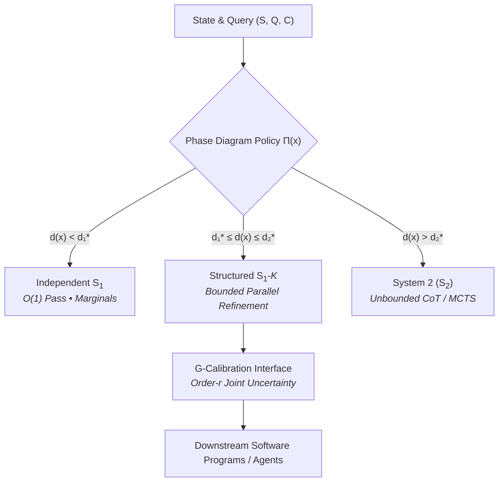

# Fast Intelligence & Adaptive Inference: Structured System‑1 Models

[](#)
[](file:///Users/zhoufuwang/projects/system1/RESEARCH_AGENDA.md)

Welcome to the **System‑1 Research Agenda** repository. This project investigates the foundations, boundaries, and trade-offs of fast amortized intelligence and adaptive System‑1 / System‑2 inference.

The full whitepaper and research agenda is available in [RESEARCH_AGENDA.md](file:///Users/zhoufuwang/projects/system1/RESEARCH_AGENDA.md).

---

## Executive Framing

Instead of viewing "System‑1" as a single heuristic forward pass, we formalize it as a family of **amortized bounded-computation decision procedures**:

$$f_\theta : (S, Q, C) \mapsto q_\theta(Y \mid S, Q, C)$$

operating under a strict computational contract without unbounded search.



---

## The 5 Flagship Research Programs

Detailed experiment designs, theoretical targets, and falsification criteria for each program are documented in [RESEARCH_AGENDA.md](file:///Users/zhoufuwang/projects/system1/RESEARCH_AGENDA.md):

1. **[Parallel Intuition](file:///Users/zhoufuwang/projects/system1/RESEARCH_AGENDA.md#finalist-1):** Structured decisions via fixed $K$-round parallel latent refinement without autoregressive serialization.
2. **[The Fast–Slow Phase Diagram](file:///Users/zhoufuwang/projects/system1/RESEARCH_AGENDA.md#finalist-2):** Mapping the computational crossover boundary across independent axes of serial depth vs. parallel width.
3. **[Calibration Does Not Compose](file:///Users/zhoufuwang/projects/system1/RESEARCH_AGENDA.md#finalist-3):** Characterizing program calibration ($G$-calibration) and the higher-order uncertainty interfaces required for downstream logical workflows.
4. **["Should I Think?"](file:///Users/zhoufuwang/projects/system1/RESEARCH_AGENDA.md#finalist-4):** Replacing uncertainty-based routing with direct estimation of the counterfactual value of deliberation $\Delta(x) = \mathbb{E}[U(S_2) - U(S_1) - \lambda C_{S_2}]$.
5. **[Compile or Compute?](file:///Users/zhoufuwang/projects/system1/RESEARCH_AGENDA.md#finalist-5):** Mapping the amortization frontier and testing size/depth extrapolation limits when compiling search into weights.

---

## Repository Structure & Interactive Visualizations

```
/Users/zhoufuwang/projects/system1/
├── index.html                               # Interactive Lab Portal & Synthesis Dashboard
├── research_agenda.html                     # Interactive Research Agenda (with filterable cards & diagrams)
├── multimodal_system1_deep_research.html    # Interactive Multimodal Decision Models Report
├── RESEARCH_AGENDA.md                       # Full research agenda markdown (72 KB, 17 candidates)
├── multimodal_system1_deep_research.md      # Multimodal deep research survey markdown
└── README.md                                # Overview and quick-start navigation
```

### Interactive HTML Reports (Open in any Browser)

- 🌐 **[index.html](file:///Users/zhoufuwang/projects/system1/index.html)**: Lab Portal linking both research streams with a strategic synergy matrix and synthesis diagram.
- 🔬 **[research_agenda.html](file:///Users/zhoufuwang/projects/system1/research_agenda.html)**: Interactive visual whitepaper featuring filterable candidate cards (A–Q), 9 vertical Mermaid TD diagrams, KaTeX math typesetting, and citation popovers.
- 👁️ **[multimodal_system1_deep_research.html](file:///Users/zhoufuwang/projects/system1/multimodal_system1_deep_research.html)**: Interactive deep research survey on multimodal decision models featuring 5 vertical Mermaid TD diagrams, taxonomy grids, and risk–compute trade-off visualizations.
