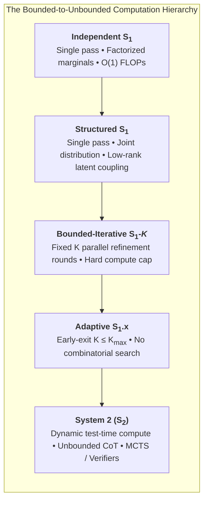
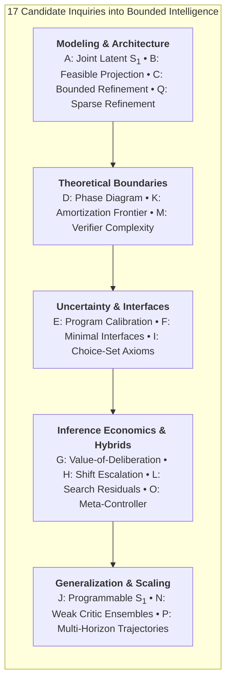
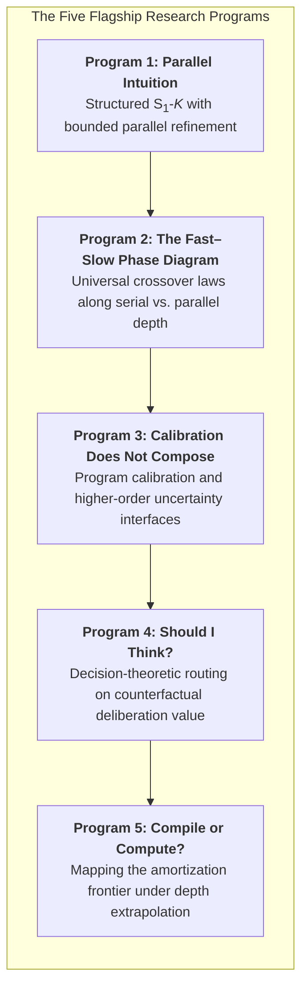
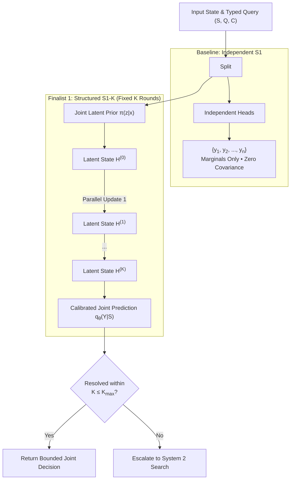
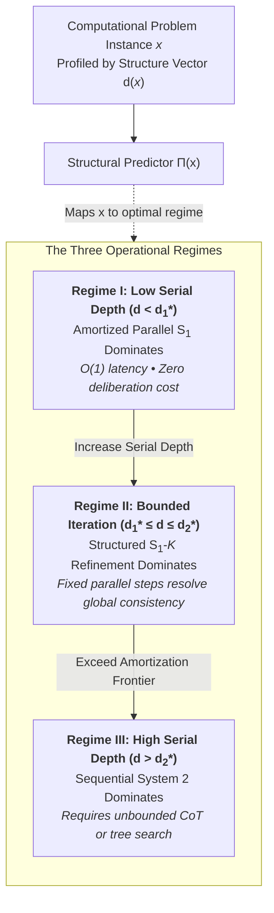
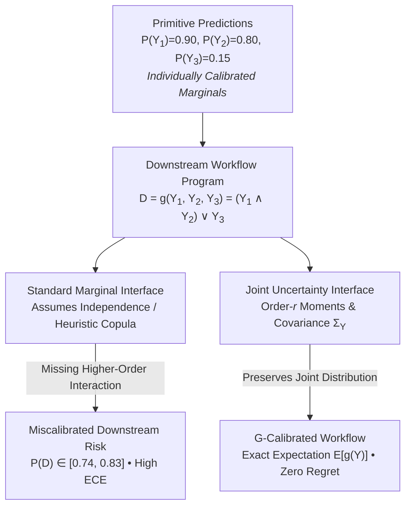
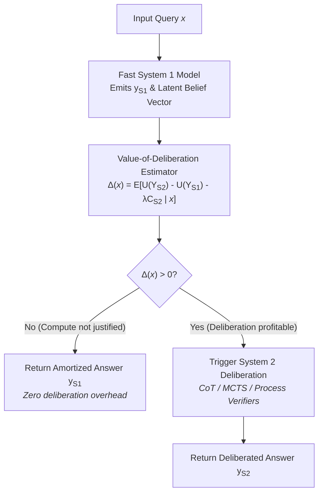
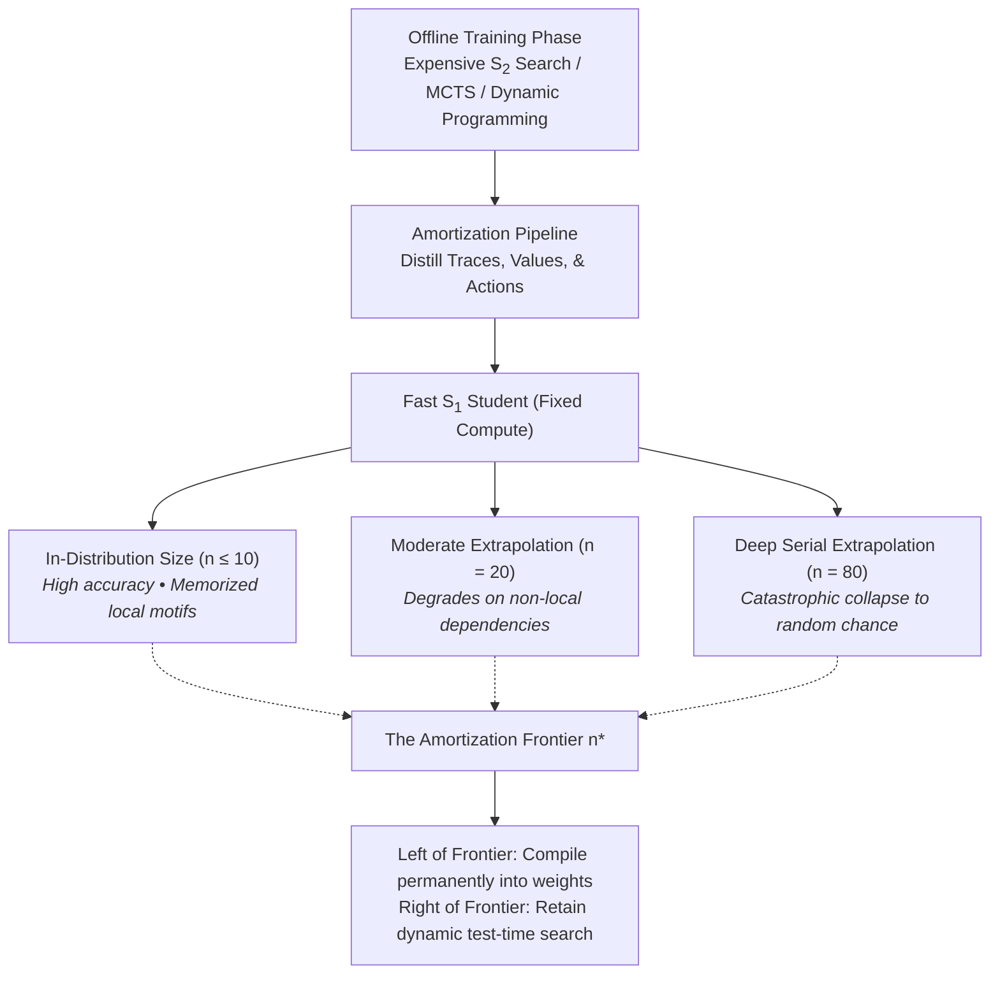
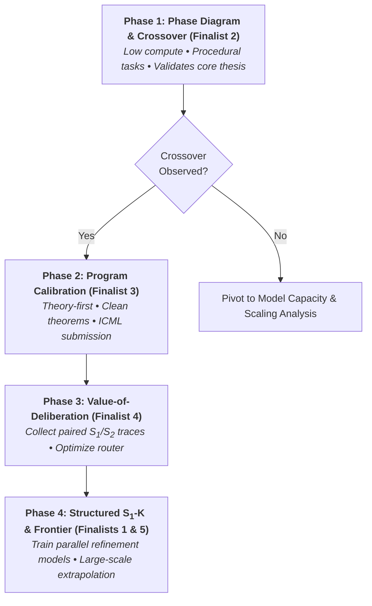

# How Far Can Fast Intelligence Go?
## A Research Agenda for Structured System‑1 Models and Adaptive System‑1 / System‑2 Inference

> **Executive Summary:**  
> This research agenda reframes "System‑1" machine intelligence from monolithic forward passes to a formal family of **amortized bounded-computation decision procedures**. By decoupling compute contract from architectural topology, we establish a theoretical and empirical roadmap bridging fast amortized intuition, bounded iterative refinement ($S_1\text{-}K$), and unbounded deliberative reasoning ($S_2$). We identify five foundational research frontiers, formulate 17 concrete research candidates, aggressively filter them down to five high-impact finalist programs, and propose a phased research roadmap for academic and industrial research labs.

---

## 1. Executive Synthesis & Theoretical Framing

### 1.1 Formalizing System‑1 as Bounded-Computation Inference

The most productive way to think about "System‑1" in machine learning is **not** as a particular commercial product, neural network topology, or single forward pass. Rather, we define the research object as a family of **amortized bounded-computation decision procedures**:

$$f_\theta : (S, Q, C) \mapsto q_\theta(Y \mid S, Q, C)$$

where:
- $S$ denotes the environmental or contextual state,
- $Q$ denotes a typed query or task specification,
- $C$ denotes a candidate action set or schema constraint,
- $q_\theta$ is a joint distribution over decisions $Y$, and
- The underlying inference graph obeys a **strict computational contract**: it admits no open-ended search, no token-by-token deliberation with unbounded stopping time, and no input-dependent exploration graph whose depth can expand arbitrarily without a fixed, predetermined cap.

### 1.2 The Inference Hierarchy

This definition induces a natural and rigorous computational hierarchy:

$$\boxed{
\text{Independent } S_1 
\;\subset\; 
\text{Structured } S_1 
\;\subset\; 
\text{Bounded-Iterative } S_1\text{-}K 
\;\subset\; 
\text{Adaptive } S_1.x 
\;\subset\; 
\text{System } 2
}$$

We operationalize the boundaries across this spectrum:

- **Independent $S_1$:** Factorized marginal predictions $\prod_i q(y_i \mid S, Q, C)$ produced in a single forward pass ($O(1)$ critical path).
- **Structured $S_1$:** Joint predictions $q(Y \mid S, Q, C)$ incorporating coordinate covariance and global constraints within a single feedforward pass.
- **Bounded-Iterative $S_1\text{-}K$:** Permits a predetermined $K$ rounds of parallel latent or output refinement ($K \in \{1, 2, 4, 8\}$). Crucially, $K$ is invariant to problem difficulty and fixed strictly by the hardware/latency contract.
- **Adaptive $S_1.x$:** Halts early when confident ($K \le K_{\max}$), but retains a hard computational ceiling and does not branch into an expanding search tree.
- **System 2 ($S_2$):** Allocates compute dynamically and without a rigid upper bound—by lengthening token-level reasoning traces (Chain-of-Thought), sampling counterfactual trajectories, backtracking, executing Monte Carlo Tree Search (MCTS), invoking external verification tools, or looping until an external acceptance criterion is satisfied.

### 1.3 Undermining the "Fast = 1 Pass, Slow = Recurrent" Dichotomy

Recent machine learning breakthroughs demonstrate that the historical boundary between "fast intuition" and "slow deliberation" is fundamentally misdrawn:

1. **Recurrent-Depth Transformers:** Scaling latent recurrent iterations within fixed parameters yields reasoning improvements without verbalizing intermediate tokens in natural language [[18](#ref-18)].
2. **Continuous Energy Landscapes:** Energy-based reasoning frameworks (such as IRED) demonstrate that parallel gradient descent on learned energy functions can satisfy combinatorial constraints iteratively without autoregressive generation [[8](#ref-8)].
3. **Masked Diffusion and Parallel Solvers:** Masked discrete diffusion models denoise all tokens in parallel over a fixed schedule, matching autoregressive modeling performance while admitting formal mathematical equivalence to looped Transformer computation [[6](#ref-6), [15](#ref-15), [16](#ref-16)].
4. **Typed Discriminative Engines:** Evaluations of non-generative foundation models (e.g., Jev) show that zero-shot classification, rubric placement, and ranking can achieve remarkable zero-shot accuracy across diverse benchmark suites while exhibiting distinct probability calibration profiles across continuous vs. binary targets [[11](#ref-11)].

### 1.4 The Central Research Target: A Computational Phase Diagram

The core research question of modern machine learning is no longer whether test-time inference compute improves performance. Rather, it is:

> **What intrinsic structural properties of a problem dictate whether computation should be compiled into weights, amortized into a small fixed number $K$ of parallel refinement steps, or delegated to open-ended sequential deliberation?**

Rather than pitting $S_1$ accuracy against $S_2$ accuracy on arbitrary benchmarks, our goal is to construct and empirically map the **computational phase diagram** governed by policy $\mathcal{R}(x)$:

$$\mathcal{R}(x) = \operatorname*{arg\,max}_{r \in \{\text{one-shot},\;\text{parallel-}K,\;\text{deliberate/search}\}} \left[ \mathbb{E}[U(r, x)] - \lambda\,\mathrm{compute}(r, x) - \mu\,\mathrm{latency}(r, x) \right]$$

To map $\mathcal{R}(x)$, we decouple computational problems across five structural primitives:

$$\boxed{\text{Joint Structure}} \qquad \boxed{\text{Parallel Refinement Depth}} \qquad \boxed{\text{Serial Computation Requirement}} \qquad \boxed{\text{Compositional Uncertainty}} \qquad \boxed{\text{Marginal Value of Compute}}$$

---

## 2. Literature Landscape & Critical Open Gaps

A critical survey of foundational literature establishes that while individual architectural mechanisms exist, their synthesis into a coherent theory of bounded probabilistic intelligence remains unbuilt.

### 2.1 The State of the Art vs. Fundamental Open Problems

| Research Theme | Established State of the Art | The Core Unresolved Frontier |
|---|---|---|
| **Fast / Slow Hybrids** | System‑1.x partitions planning subgoals into direct execution vs. tree search [[7](#ref-7)]; *Reasoning on a Spectrum* uses entropy arbitration between $S_1$ and $S_2$ variants [[5](#ref-5)]. | Routing remains conditioned on *difficulty/uncertainty* rather than the counterfactual **marginal value of deliberation**. No structural theory explains *why* direct inference fails on specific instances. |
| **Iterative Latent Compute** | Recurrent-depth models scale reasoning latently [[18](#ref-18)]; IRED iteratively minimizes energy [[8](#ref-8)]; masked diffusion iteratively denoises in parallel [[15](#ref-15)]. | Absence of an empirical taxonomy or formal theory separating what $K \in \{1, 2, 4, 8\}$ parallel rounds can solve from what requires unbounded sequential CoT. |
| **Parallel vs. Sequential Reasoning** | Circuit expressivity proves low-depth Transformers inherently lack serial depth, which CoT restores [[1](#ref-1)]; masked diffusion theory demonstrates parallel supremacy on log-depth reductions [[6](#ref-6)]. | No unified empirical **phase diagram** independently isolating serial depth, parallel width, graph treewidth, and branching factors. |
| **Structured Prediction** | Continuous and discrete EBMs enforce combinatorial constraints and tractably normalize over permutation spaces [[3](#ref-3), [8](#ref-8)]. | Missing a low-latency, typed, calibrated **joint decision interface** that emits valid compound probabilities to downstream software. |
| **Non-Autoregressive Generation** | Masked diffusion (e.g., LLaDA) scales to large models and closes the generative gap with autoregressive models [[15](#ref-15), [16](#ref-16)]. | Simply applying diffusion is no longer novel. The open frontier is characterizing the **structural conditions** under which parallel refinement dominates sequential generation. |
| **Multivariate Calibration** | Coordinate-wise calibration is known to produce invalid compound risks in multidimensional settings; sample-based recalibration restores joint validity [[9](#ref-9)]. | Calibration behavior remains entirely unstudied after **logical, programmatic, and arithmetic composition** by external software pipelines. |
| **Structured Uncertainty** | Conformal structured prediction yields rigorous finite-sample coverage guarantees for combinatorial sets [[10](#ref-10)]. | Coverage sets guarantee inclusion but fail to provide granular joint probabilities for arbitrary downstream functions $g(Y_1, \dots, Y_n)$. |
| **Selective Routing & Cascades** | Self‑REF trains confidence tokens for abstention [[14](#ref-14)]; ICML 2025 unifies routing/cascades [[2](#ref-2)]; ZIP-RC predicts test-time reward and compute cost [[22](#ref-22)]. | **Confidence that $S_1$ is correct is orthogonal to the probability that $S_2$ will fix an $S_1$ error.** This distinction remains unexploited in routing architectures. |
| **Test-Time Compute Allocation** | Non-monotonic scaling shows excessive CoT induces reasoning degradation and overthinking [[17](#ref-17)]. | Dynamic compute allocation must optimize the *marginal utility* of compute rather than treating thinking time as a monotonic performance booster. |
| **Programmable Classifiers** | Universal NLI classifiers and Text2Model map natural-language task specifications directly to equivariant classifier weights [[19](#ref-19), [21](#ref-21)]. | Systems lack **decision-specification generalization** that transfers over complex relational operators, novel rankings, and programmatic constraints. |
| **Choice-Set Effects** | LLM selections exhibit decoy effects, compromise effects, and presentation-order vulnerabilities [[4](#ref-4)]. | Simple permutation invariance is insufficient; the field lacks normative axioms that distinguish *legitimate context-dependence* from *pathological manipulation*. |
| **Distilled Reasoning** | CoT reasoning distilled into high-throughput sub-quadratic architectures (Mamba/hybrids) alters test-time trade-offs [[20](#ref-20)]. | The true **amortization frontier** remains uncharted: which algorithmic computations compile permanently into weights, and which fail under depth extrapolation? |
| **Process Verifiers** | Process advantage verifiers provide dense reward signals to guide search and reinforcement learning [[12](#ref-12)]. | The fundamental complexity question is unanswered: **when is verification intrinsically computationally cheaper than generation**, and when does it require re-solving the problem? |

---

### 2.2 Two Crucial Theoretical Realizations

#### Observation 1: Marginal Calibration Does Not Guarantee Program Calibration
Consider two binary decision variables $A$ and $B$, emitted by an independently calibrated classifier:

$$P(A=1) = 0.9, \qquad P(B=1) = 0.8$$

A downstream programmatic agent requires the joint satisfaction of both conditions: $g(A, B) = A \land B$. Under marginal calibration alone, Fréchet inequalities dictate:

$$P(A \land B) \in \left[\max(0, 0.9 + 0.8 - 1), \min(0.9, 0.8)\right] = [0.70, 0.80]$$

If the software pipeline assumes independence, it assigns $\hat{p} = 0.9 \times 0.8 = 0.72$. If the real system has positive correlation ($P(A \land B) = 0.80$), the downstream expected risk is severely misestimated. 

This error is **not** an estimation artifact or miscalibration bug in the individual heads—it is an **information-theoretic failure of the interface**. The marginals do not contain the joint distribution [[9](#ref-9)].

#### Observation 2: Fixed-Round Iterative Computation ($S_1\text{-}K$) is a Distinct Computational Regime
Empirical work on recurrent-depth Transformers, masked diffusion, and energy minimization demonstrates that significant reasoning occurs without sequential CoT tokens [[6](#ref-6), [8](#ref-8), [18](#ref-18)]. The central scientific problem is to rigorously identify the structural boundary where:

$$A_{K=1} < A_{K=2} < A_{K=4} \approx A_{S_2}$$

versus where every fixed $K$ collapses as problem depth scales to infinity.

---

## 3. Comprehensive Portfolio of 17 Research Candidates

We formalize 17 concrete research candidates designed to explore the bounded intelligence landscape.

---

### Candidate A — Joint Latent-Variable System‑1

- **Research Question:** Can a fixed-cost $S_1$ model capture complex dependencies across dozens of simultaneous decisions while retaining parallel, non-autoregressive inference?
- **Core Hypothesis:** Much of the gain commonly attributed to sequential CoT on multi-decision tasks stems from conditioning on a joint latent state. It can be captured via a small latent mixture:
  $$q(Y \mid x) = \sum_{z=1}^{M} \pi_z(x) \prod_{i=1}^n q_i(y_i \mid x, z)$$
- **Why Existing Methods Fail:** Independent heads discard covariance; autoregressive decoders impose arbitrary order and linear latency $O(n)$; full EBMs suffer from intractable partition functions [[3](#ref-3)].
- **Proposed Method:** Compare independent heads against $M$-component mixtures, low-rank Gaussian copula heads, and fixed-step refinement, optimizing joint NLL.
- **Clean Experiment:** Synthetic multivariate Bernoulli benchmarks with tunable factor graphs; multilabel image/text tagging; constraint-dense scheduling state evaluations.
- **Baselines:** Independent classification heads; Autoregressive Transformer; Energy-Based Models (IRED); Masked Diffusion; Sequential LLM.
- **Measurements:** Joint NLL, exact-match accuracy, pairwise covariance error, compound event Brier score, inference latency (ms).
- **Expected Finding:** A low-rank latent bottleneck ($M \le 16$) closes $>80\%$ of the independent-to-AR performance gap on low-treewidth problems, failing only on dense high-order cliques.
- **Fatal Flaw:** If shared representations in standard Transformers already capture sufficient decision dependence via independent linear readouts.
- **Novelty Risk:** High unless framed around the **bounded-compute dependence frontier** rather than generic structured prediction.
- **Fundamental Significance:** Establishes the representational limits of non-autoregressive joint probability distributions.

---

### Candidate B — Feasible-by-Construction System‑1

- **Research Question:** Can a bounded neural architecture guarantee global constraint satisfaction without combinatorial search or independent projection heuristics?
- **Core Hypothesis:** One to four learned parallel projection steps can map unconstrained logits into a globally feasible manifold much faster than combinatorial decoders.
- **Why Existing Methods Fail:** Independent classification outputs violate mutual exclusivity; standard constrained decoders (ILP/Z3) become slow $S_2$ bottlenecks [[8](#ref-8)].
- **Proposed Method:** Compile linear and Boolean constraints into a differentiable projection layer unrolled for exactly $K$ parallel gradient steps without dynamic convergence loops.
- **Clean Experiment:** Bipartite matching, graph coloring, Sudoku fragments, and 3-SAT instances where local heuristics are adversarially deceptive.
- **Baselines:** Independent logits; Independent logits + ILP projection; Autoregressive decoder; IRED energy optimization; Exact combinatorial solver.
- **Measurements:** Feasibility rate, Hamming accuracy, exact match, runtime compute normalized against ILP solvers.
- **Expected Finding:** Fixed refinement outperforms unconstrained models on structured tasks, but fails when constraint graphs require global backtracking.
- **Fatal Flaw:** If simple post-hoc projection algorithms (e.g., Hungarian algorithm, greedy repair) are strictly faster and more accurate than learned neural modules.
- **Novelty Risk:** High due to proximity to IRED [[8](#ref-8)]; must emphasize **fixed-compute amortization vs. exact-solver phase transitions**.
- **Fundamental Significance:** Clarifies whether constraint satisfaction requires iterative search or can be compiled into feedforward geometry.

---

### Candidate C — How Many Refinement Rounds Turn Intuition into Reasoning?

- **Research Question:** What qualitative capability transitions occur as a parallel decision model advances through $K \in \{1, 2, 4, 8\}$ fixed refinement rounds?
- **Core Hypothesis:** The capability curve is not a smooth logarithmic continuum; it exhibits three sharp, disjoint computational regimes:
  1. $K=1$: Reflexive single-hop associative recall.
  2. $K \in \{2, 4\}$: Global constraint propagation and multi-variable consistency resolution.
  3. $K \ge 8$: Invariant failure when problem serial depth exceeds $K$.
- **Why Existing Methods Fail:** Recurrent-depth models and diffusion frameworks scale iterations arbitrarily without characterizing the structural expressivity thresholds of small constant depths [[6](#ref-6), [18](#ref-18)].
- **Proposed Method:** Train a shared-weight parallel refinement operator $Y^{k+1} = F_\theta(S, Q, C, Y^k, k)$ with random corruption masks, evaluating the exact same model at $K \in \{1, 2, 4, 8\}$.
- **Clean Experiment:** Balanced tree evaluation vs. linear pointer chasing; 2D grid pathfinding with varying obstacle densities.
- **Baselines:** Feedforward Transformer ($K=1$); Recurrent-depth Transformer; Masked Diffusion; Autoregressive CoT.
- **Measurements:** Accuracy vs. $K$, marginal gain $\Delta_K = A_{K} - A_{K-1}$, FLOP efficiency, out-of-distribution depth generalization.
- **Expected Finding:** Parallel reductions saturate rapidly at $K=2$ or $4$, whereas serial dependency chains exhibit zero gain until $K$ matches instance depth.
- **Fatal Flaw:** If accuracy scales smoothly and monotonically across all tasks with no distinguishable phase boundaries.
- **Novelty Risk:** Moderate; must build on ICLR 2026 diffusion theory [[6](#ref-6)] by formalizing a **computational taxonomy of parallel refinement depth**.
- **Fundamental Significance:** Provides a concrete operational definition of the boundary between associative intuition and deliberative computation.

---

### Candidate D — A Phase Diagram for the System‑1 / System‑2 Crossover

- **Research Question:** Which structural properties of a computational DAG predict the exact point where amortized parallel inference loses to sequential deliberation?
- **Core Hypothesis:** Instance "difficulty" is a misleading scalar. The crossover is governed by a multi-dimensional structural vector:
  $$d(x) = (\text{serial depth},\; \text{parallel width},\; \text{dependency treewidth},\; \text{branching factor})$$
- **Why Existing Methods Fail:** Standard NLP benchmarks conflate knowledge retrieval, linguistic complexity, and computational depth [[1](#ref-1), [6](#ref-6)].
- **Proposed Method:** Build procedural task generators independently parameterizing serial depth $O(n)$ vs. parallel width $O(\log n)$. Fit the empirical crossover surface $d^*(B_{S_1}, B_{S_2})$.
- **Clean Experiment:** Pointer evaluation chains vs. balanced tree reductions; Boolean circuit evaluations of matched size but varying depths.
- **Baselines:** One-shot $S_1$; Bounded $S_1\text{-}K$; Recurrent-depth latent models; Autoregressive CoT; Best-of-$N$ sampling.
- **Measurements:** Accuracy, compute-normalized Pareto curves, critical path latency, policy regret of structural routers.
- **Expected Finding:** Tasks with identical error rates under $S_1$ split completely: wide tasks favor parallel $S_1\text{-}K$, while deep tasks require $S_2$.
- **Fatal Flaw:** If structural metrics measured on synthetic DAGs fail to transfer to natural-language reasoning tasks.
- **Novelty Risk:** Low-to-moderate if centered on discovering a **cross-family universal phase law**.
- **Fundamental Significance:** Resolves the limits of fast intelligence as a function of circuit complexity.

---

### Candidate E — Program-Calibrated System‑1

- **Research Question:** What uncertainty representation must a decision engine emit so that downstream programs composed from its predictions remain calibrated?
- **Core Hypothesis:** Coordinate-wise marginal calibration fails under logical composition. Downstream programs of multilinear interaction degree $r$ strictly require joint uncertainty moments up to order $r$.
- **Why Existing Methods Fail:** Standard temperature scaling and isotonic regression treat dimensions independently [[9](#ref-9)]; conformal prediction outputs coverage sets rather than composable probabilities [[10](#ref-10)].
- **Proposed Method:** Formalize **$G$-calibration** for a program family $\mathcal{G}$. Derive sufficiency conditions for marginal, pairwise, and joint sampling interfaces under multilinear expansions:
  $$g(Y) = \sum_{A \subseteq [n]} c_A \prod_{i \in A} Y_i \implies \mathbb{E}[g(Y)] = \sum_A c_A \mathbb{E}\left[\prod_{i \in A} Y_i\right]$$
- **Clean Experiment:** Synthetic multivariate Bernoulli environments feeding Boolean formulas, voting networks, and agent action policies.
- **Baselines:** Independent marginals; Pairwise Gaussian copulas; Multidimensional recalibration [[9](#ref-9)]; Generative joint Monte Carlo samples.
- **Measurements:** Program Expected Calibration Error ($G\text{-ECE}$), Brier score, downstream decision regret.
- **Expected Finding:** Independent calibration degrades catastrophically as program depth increases; exposing order-$r$ joint statistics restores exact calibration.
- **Fatal Flaw:** If downstream workflow tasks exhibit such weak dependence in practice that product-of-marginals approximations remain empirically sufficient.
- **Novelty Risk:** Low; bridges mathematical calibration theory directly with compound AI software systems.
- **Fundamental Significance:** Defines the minimal interface contract between probabilistic foundation models and deterministic software.

---

### Candidate F — Minimal Uncertainty Interfaces

- **Research Question:** What is the minimal compressed statistic of a predictive distribution that preserves expected utility for a known downstream decision class?
- **Core Hypothesis:** Exposing full $2^n$ joint probabilities is unnecessary; low-dimensional projections tailored to the decision family preserve $>99\%$ of policy utility.
- **Why Existing Methods Fail:** Full joint estimation scales exponentially; standard APIs compress everything down to marginal scalars, losing critical covariance [[9](#ref-9)].
- **Proposed Method:** Derive rate-distortion bounds on the dimension of sufficient statistic $T(P_Y)$ such that $|\mathbb{E}_{P}[g(Y)] - \mathbb{E}_{T}[g(Y)]| \le \epsilon$ for all $g \in \mathcal{G}$.
- **Clean Experiment:** Threshold functions, monotone CNF/DNF workflows, portfolio risk allocation programs.
- **Baselines:** Marginals ($n$ parameters); Pairwise moments ($O(n^2)$); Low-rank mixtures ($M \times n$); Full empirical joint samples.
- **Measurements:** Bit-length of interface representation vs. decision regret and maximum probability error.
- **Expected Finding:** Program structural complexity, not variable count $n$, dictates the required bandwidth of the uncertainty interface.
- **Fatal Flaw:** If the analytical characterization becomes mathematically trivial once $\mathcal{G}$ is restricted.
- **Novelty Risk:** Moderate; requires non-trivial information-theoretic lower bounds to avoid reading as a compression heuristic.
- **Fundamental Significance:** Establishes the communication complexity of machine-to-machine probabilistic interfaces.

---

### Candidate G — Route on the Value of Deliberation, Not Uncertainty

- **Research Question:** Can a router predict the counterfactual utility gain of invoking System‑2, rather than relying on System‑1 uncertainty as a proxy?
- **Core Hypothesis:**
  $$P(S_1 \text{ is wrong} \mid x) \neq P(S_2 \text{ improves over } S_1 \mid x)$$
  Uncertainty-based routing wastes expensive compute on intrinsically intractable problems and misses confidently wrong $S_1$ failures that $S_2$ could repair.
- **Why Existing Methods Fail:** Self‑REF, cascade classifiers, and entropy arbitration route based on $S_1$ difficulty or confidence [[2](#ref-2), [5](#ref-5), [14](#ref-14)]; they fail to model the joint outcome distribution.
- **Proposed Method:** Collect paired offline outcomes $(Y_{S_1}, Y_{S_2})$ and train a direct value-of-deliberation estimator:
  $$\Delta(x) = \mathbb{E}\left[ U(Y_{S_2}, y^*) - U(Y_{S_1}, y^*) - \lambda C_{S_2} \mid x, Y_{S_1} \right]$$
  Escalate to $S_2$ if and only if $\hat{\Delta}(x) > 0$.
- **Clean Experiment:** Benchmarks spanning 4 distinct instance cells: (1) Easy for both, (2) $S_1$-only, (3) $S_2$-solvable errors, (4) Hard for both (hopeless).
- **Baselines:** Maximum softmax probability; Predictive entropy; Margin score; Self‑REF [[14](#ref-14)]; Standard cascading [[2](#ref-2)]; Oracle router.
- **Measurements:** Expected utility, Pareto accuracy-compute frontier, AUROC for $S_2$ gain, compute wasted on mutually failed tasks.
- **Expected Finding:** Direct value-of-deliberation routing dominates confidence-based routing, cutting $S_2$ compute by $>30\%$ at identical accuracy.
- **Fatal Flaw:** If $S_1$ confidence correlates so strongly with $S_2$ repairability that $\Delta(x)$ provides negligible independent signal.
- **Novelty Risk:** Moderate-high; the field of LLM routing is crowded. Must demonstrate a **formal decision-theoretic formulation** to stand out.
- **Fundamental Significance:** Replaces heuristic routing with optimal metareasoning principles.

---

### Candidate H — Distribution-Shift-Aware Escalation

- **Research Question:** How can a bounded model distinguish familiar in-distribution uncertainty from structural out-of-distribution (OOD) invalidation?
- **Core Hypothesis:** Epistemic OOD signals identify cases where $S_1$ intuition fails due to covariate/structural shift, whereas aleatoric uncertainty identifies inherently ambiguous cases where $S_2$ also fails.
- **Why Existing Methods Fail:** In-distribution calibration guarantees fail under subpopulation shifts; empirical security evaluations show $S_1$ models remain confidently wrong under adversarial distribution shifts [[13](#ref-13)].
- **Proposed Method:** Jointly predict correctness, epistemic density via latent representations, and counterfactual $S_2$ utility, yielding a 3-way action: *Accept*, *Deliberate*, or *Abstain*.
- **Clean Experiment:** Synthetic factor-graph perturbations (varying edge topology while preserving marginals); natural agent-security jailbreak suites [[13](#ref-13)].
- **Baselines:** Temperature scaling; Mahalanobis distance OOD detection; Conformal prediction sets [[10](#ref-10)]; Pure confidence routers.
- **Measurements:** Selective risk, coverage, worst-group accuracy, calibration under distribution shift.
- **Expected Finding:** Epistemic signals trigger escalation to $S_2$ under structural shifts where standard confidence scores remain deceptively overconfident.
- **Fatal Flaw:** If OOD density estimators fail to detect subtle semantic shifts in high-dimensional representations.
- **Novelty Risk:** Moderate; must strictly tie OOD detection to the **counterfactual repairability of $S_2$** rather than generic anomaly detection.
- **Fundamental Significance:** Establishes safety limits and escalation protocols for amortized decision systems.

---

### Candidate I — Rational vs. Pathological Choice-Set Dependence

- **Research Question:** What axiomatic foundations separate rational context-dependent evaluation from pathological vulnerability to irrelevant alternatives?
- **Core Hypothesis:** Strict Independence of Irrelevant Alternatives (IIA) is overly restrictive for relational tasks, but unconstrained joint scoring introduces susceptibility to option manipulation and decoy effects [[4](#ref-4)].
- **Why Existing Methods Fail:** Standard softmax over independent scores enforces IIA strictly; unconstrained set Transformers are vulnerable to adversarial decoy insertions [[4](#ref-4), [19](#ref-19)].
- **Proposed Method:** Define an axiomatic hierarchy:
  $$\text{Permutation Equivariance} \implies \text{Clone Conservation} \implies \text{Dominance Consistency} \implies \text{Bounded Contextuality}$$
  Enforce clone conservation: if candidate $A'$ is an $\epsilon$-clone of $A$, then $P(A) + P(A') \approx P_{\text{original}}(A)$.
- **Clean Experiment:** Synthetic multi-attribute choice tasks with known utility functions; option permutations, semantic paraphrases, and decoy alternatives.
- **Baselines:** Independent candidate scorer; Set Transformer; LLM prompt-based judge; Sequential reasoning LLM.
- **Measurements:** Preference-reversal rate, clone-addition regret, ranking stability, calibration across candidate set cardinality.
- **Expected Finding:** Axiomatically regularized set architectures eliminate decoy manipulation while preserving legitimate context sensitivity.
- **Fatal Flaw:** If the proposed axioms prove incompatible with real human subjective preferences in natural language contexts.
- **Novelty Risk:** Moderate; requires rigorous normative decision theory to transcend basic LLM sensitivity benchmarks.
- **Fundamental Significance:** Establishes formal semantics for choice-conditioned decision interfaces $P(Y \mid S, Q, C)$.

---

### Candidate J — Decision Generalization: Programmable Discriminative Intelligence

- **Research Question:** Can a bounded discriminative model generalize to novel decision specifications $Q$ and candidate semantics $C$ without autoregressive token generation?
- **Core Hypothesis:** A non-generative model can learn a compositional "decision algebra" over structured queries, generalising across unseen logical rules while remaining $10\times$ faster than an LLM.
- **Why Existing Methods Fail:** Universal NLI classifiers handle novel labels but struggle with complex logical compositions [[21](#ref-21)]; Text2Model generates classifiers for static descriptions but lacks relational operators [[19](#ref-19)].
- **Proposed Method:** Train an encoder-conditioned cross-attention architecture on procedurally generated decision schemas containing nested Boolean rules, priority orderings, and dynamic thresholds.
- **Clean Experiment:** Synthetic attribute states evaluated against held-out formal specifications (e.g., "Select candidates satisfying $A \land \neg B$ ordered by $C$").
- **Baselines:** Specialized fine-tuned classifiers; Universal NLI [[21](#ref-21)]; Text2Model [[19](#ref-19)]; Few-shot instruction-tuned LLMs.
- **Measurements:** Compositional generalization accuracy by rule depth, latency, parameter efficiency.
- **Expected Finding:** Non-generative models successfully execute compositional decision rules up to a fixed depth before requiring sequential CoT parsers.
- **Fatal Flaw:** If small instruction-tuned autoregressive LLMs (e.g., 1B–3B parameters) are fast enough to eliminate the latency advantage of non-generative models.
- **Novelty Risk:** High; must evaluate generalization over **decision logic**, not zero-shot label semantics.
- **Fundamental Significance:** Tests whether programmatic task comprehension requires autoregressive token generation.

---

### Candidate K — The Amortization Frontier: What Reasoning Can Be Compiled into Weights?

- **Research Question:** Under what structural conditions can an expensive search policy be compiled into fixed-cost weights without failing under instance size extrapolation?
- **Core Hypothesis:** Algorithmic search compiles successfully into feedforward weights only when the optimal policy admits a size-invariant local dynamic programming representation; it fails catastrophically when global serial depth scales with input size $n$.
- **Why Existing Methods Fail:** Distillation literature demonstrates strong in-distribution imitation on math benchmarks [[20](#ref-20)], but fails to test systematic depth and size extrapolation [[1](#ref-1)].
- **Proposed Method:** Formalize the amortization surface $A(n, d, N_{\text{train}}, C_{\text{student}})$. Train students on expert search traces (MCTS/A*) across sizes $n \le 10$, then evaluate zero-shot on sizes $n \in \{20, 40, 80\}$.
- **Clean Experiment:** Grid mazes, shortest paths on random graphs, dynamic programming (knapsack), and iterated permutation groups.
- **Baselines:** Behavioral cloning (answers only); Search trace distillation; Recurrent student; CoT reasoning model; Direct search teacher.
- **Measurements:** Generalization gap $\Delta_{\text{extrap}} = A(n_{\text{seen}}) - A(n_{\text{unseen}})$, compute amortization break-even query volume $N^*$.
- **Expected Finding:** Local DP algorithms extrapolate gracefully; serial pointer-chasing and global backtracking tasks collapse to random guessing.
- **Fatal Flaw:** If the failure to extrapolate is solely an artifact of limited parameter capacity rather than a computational limitation.
- **Novelty Risk:** Low-to-moderate if grounded in computational complexity and formal extrapolation tests.
- **Fundamental Significance:** Maps the boundary between learned intuitive memory and active test-time search.

---

### Candidate L — Search-Residual Prediction

- **Research Question:** Can a fast model learn to predict the structural *residual error* that deliberation would remove, rather than just imitating the teacher's final answer?
- **Core Hypothesis:** Supervising a student on the delta $R(x) = Y_{S_2}(x) - Y_{S_1}(x)$ induces representations of the student's own blind spots, improving both self-correction and routing.
- **Why Existing Methods Fail:** Conventional distillation minimizes KL divergence to teacher answers, obscuring where teacher compute provided decisive value [[20](#ref-20)].
- **Proposed Method:** Multi-task $S_1$ with two heads: (1) primary decision prediction $\hat{Y}_{S_1}$, and (2) residual correction vector $\hat{R} \approx Y_{S_2} - Y_{S_1}$.
- **Clean Experiment:** Algorithmic graph problems and constraint-satisfaction tasks with known localized error patterns.
- **Baselines:** Standard answer distillation [[20](#ref-20)]; Independent confidence estimation; Direct value-of-deliberation routing.
- **Measurements:** Residual prediction error, routing AUROC, student calibration.
- **Expected Finding:** Residual supervision teaches latent representations of structural blind spots, but direct decision improvement remains modest.
- **Fatal Flaw:** High risk of collapsing mathematically into Candidate G (value-of-deliberation routing) with added architectural complexity.
- **Novelty Risk:** High; recommended to absorb into Candidate G rather than pursuing as a standalone project.
- **Fundamental Significance:** Probes the internal interpretability of model limitations.

---

### Candidate M — When is Verification Genuinely Easier than Generation?

- **Research Question:** Which structural properties make a bounded discriminative verifier more capable than a bounded generator?
- **Core Hypothesis:** The verifier advantage is strictly bounded by the *certificate checking complexity* of the task. Verifiers provide compute leverage only when errors have local witnesses checkable in $O(1)$ depth.
- **Why Existing Methods Fail:** Process verifiers are widely used in mathematical search [[12](#ref-12)], but the literature lacks an empirical taxonomy explaining when verification collapses into full re-generation.
- **Proposed Method:** Construct matched task pairs with identical generation difficulty but divergent certificate complexity: locally verifiable paths vs. global parity/isomorphism problems.
- **Clean Experiment:** Hamiltonian paths (locally verifiable) vs. Graph non-isomorphism (globally difficult); CSP certificate validation vs. CSP solving.
- **Baselines:** Direct generator; Outcome verifier; Process verifier [[12](#ref-12)]; Combinatorial checker.
- **Measurements:** Verification vs. generation compute gap, false-acceptance rate on near-miss adversarial corruptions.
- **Expected Finding:** Bounded verifiers excel on tasks with local witness properties, but degrade to random guessing on problems requiring global reconstruction.
- **Fatal Flaw:** If empirical neural verifiers simply reflect classical computational complexity ($\text{NP} \text{ vs. } \text{P}$) with no novel deep learning phenomena.
- **Novelty Risk:** Moderate; must formalize a **neural certificate complexity bound** to avoid being dismissed as an obvious complexity observation.
- **Fundamental Significance:** Determines whether verifiers are a general architectural primitive or limited to locally checkable tasks.

---

### Candidate N — Correlated Weak Critics

- **Research Question:** When can an ensemble of cheap $S_1$ verifiers substitute for an expensive $S_2$ judge, given that weak models exhibit correlated failure modes?
- **Core Hypothesis:** The ensemble scaling law for neural critics is dominated by latent failure mode correlation rather than individual critic accuracy.
- **Why Existing Methods Fail:** Standard ensembling assumes conditionally independent errors; weak LLM verifiers share common inductive biases and blind spots [[12](#ref-12)].
- **Proposed Method:** Model shared failure modes via latent variable $Z$; train diversity-regularized critic ensembles that penalize correlated false positives.
- **Clean Experiment:** Inject systematic synthetic reasoning errors (e.g., sign flips, false premises) into mathematical and code traces.
- **Baselines:** Majority voting; Mean verifier score; Single large $S_2$ judge; Process advantage verifiers [[12](#ref-12)].
- **Measurements:** Error correlation coefficients, ensemble calibration, cost-normalized verification accuracy.
- **Expected Finding:** Diverse weak critics outperform identical strong critics up to a ceiling set by shared architectural inductive biases.
- **Fatal Flaw:** If standard ensemble theory (e.g., bias-variance-covariance decomposition) fully explains the empirical results without new machine learning insights.
- **Novelty Risk:** High; discard as a standalone paper unless structured reasoning induces fundamentally new correlation structures.
- **Fundamental Significance:** Establishes the statistical limits of distributed intuitive evaluation.

---

### Candidate O — System‑1 as a Rational Meta-Controller

- **Research Question:** Can a fast $S_1$ policy learn to select optimal computational operations (Answer, Deliberate, Search, Tool Call, Terminate) using decision-theoretic utility estimates?
- **Core Hypothesis:** Agent control can be unified into a discrete meta-action space evaluated by an $S_1$ value function:
  $$Q_{\text{meta}}(s, a) = \mathbb{E}\left[ U_{\text{task}}(s, a) - \lambda C_{\text{compute}}(a) - \mu L_{\text{latency}}(a) \right]$$
- **Why Existing Methods Fail:** Existing agents use heuristic prompts or unbounded LLM loops for self-reflection, adding substantial latency and expense [[2](#ref-2), [7](#ref-7)].
- **Proposed Method:** Train an $S_1$ meta-controller on counterfactual trace rollouts across diverse computational actions in a meta-MDP environment.
- **Clean Experiment:** Multi-turn QA with tool interfaces, math search environments, and structured web navigation tasks.
- **Baselines:** Always-deliberate ($S_2$); Fixed confidence thresholds; LLM-based reflection; Cascaded model routers [[2](#ref-2)].
- **Measurements:** Cumulative task utility, wasted computation, premature termination rate, meta-policy regret.
- **Expected Finding:** The meta-controller internalizes computational economics, outperforming heuristic agents in cost-constrained environments.
- **Fatal Flaw:** Meta-action utilities may fail to transfer across disparate task domains, degenerating into narrow task-specific heuristics.
- **Novelty Risk:** High if evaluated solely on generic agent benchmarks; must emphasize the **rational metareasoning framework**.
- **Fundamental Significance:** Treats test-time computation itself as an optimal control problem.

---

### Candidate P — Joint Multi-Horizon Trajectory Intuition

- **Research Question:** Can a bounded joint predictor generate coherent multi-horizon trajectories without suffering the latency and error accumulation of autoregressive rollouts?
- **Core Hypothesis:** Trajectory forecasting is a clean microcosm of the structured $S_1$ challenge: independent heads lose temporal covariance, while autoregressive rollouts serialize computation [[15](#ref-15)].
- **Why Existing Methods Fail:** Autoregressive rollouts suffer from compounding exposure bias and high latency; naive multi-step heads predict inconsistent physical states.
- **Proposed Method:** Combine a joint latent representation with $K$-step parallel refinement and temporal consistency constraints.
- **Clean Experiment:** Synthetic Markov decision processes with long-range dependencies; physical multi-agent navigation trajectories.
- **Baselines:** Independent multi-step heads; Autoregressive sequence models; Continuous diffusion models; Search-based planners.
- **Measurements:** Trajectory NLL, physical constraint violation rate, inference latency, long-horizon calibration.
- **Expected Finding:** Bounded joint models match autoregressive coherence over short-to-medium horizons at $10\times$ lower latency, failing only on deep bifurcation points.
- **Fatal Flaw:** Risk of merely reproducing known results from non-autoregressive sequence modeling and diffusion trajectory planning.
- **Novelty Risk:** High as a standalone contribution; better utilized as an evaluation environment within Candidates A–D.
- **Fundamental Significance:** Evaluates parallel joint inference across temporal rollouts.

---

### Candidate Q — Coordinate-Wise Adaptive Bounded Refinement

- **Research Question:** Can a structured $S_1$ model dynamically direct its fixed refinement compute to uncertain or inconsistent output coordinates without triggering open-ended search?
- **Core Hypothesis:** Structured problems typically possess a small "hard core" of difficult constraints; updating all variables uniformly across all refinement steps wastes computation [[18](#ref-18), [22](#ref-22)].
- **Why Existing Methods Fail:** Recurrent models update entire activation states uniformly [[18](#ref-18)]; token-level early exiting often impairs downstream sequence coherence.
- **Proposed Method:** Learn coordinate gating masks $g_i^{(k)} \in \{0, 1\}$ subject to a strict total budget $\sum_{i, k} g_i^{(k)} \le B_{\text{max}}$, freezing resolved coordinates across parallel refinement steps.
- **Clean Experiment:** Sudoku grids and graph coloring instances where difficulty is concentrated in localized subgraphs.
- **Baselines:** Uniform $K$-step refinement; Static one-shot models; Global early-exit models; Full combinatorial decoders.
- **Measurements:** Accuracy vs. active FLOPs, gating score calibration, hard-core identification recall.
- **Expected Finding:** Sparse refinement achieves the accuracy of dense $K$-step models at a fraction of the theoretical FLOP cost.
- **Fatal Flaw:** On modern hardware accelerators (GPUs/TPUs), sparse conditional computation often runs slower in wall-clock time than dense tensor operations.
- **Novelty Risk:** High as an architectural proposal; worthwhile primarily if it reveals that **computational difficulty is spatially localized**.
- **Fundamental Significance:** Explores the optimal spatial granularity of test-time compute allocation.

---

## 4. Filtering Matrix & Strategic Category Map

### 4.1 Evaluation Matrix Across Core Dimensions

| Category | High-Priority Candidates | Conditional / Specialized Candidates | Deprioritized / Redundant Candidates |
|---|---|---|---|
| **A. Modeling & Architecture** | **A:** Joint Latent $S_1$ **C:** Bounded Refinement $S_1\text{-}K$ | **B:** Feasible-by-Construction Projection | **Q:** Coordinate-Wise Adaptive Refinement *(Hardware overhead risk)* |
| **B. Theoretical Foundations** | **D:** Phase Diagram for Crossover **K:** The Amortization Frontier | **M:** Certificate Verification Complexity | — |
| **C. Uncertainty & Interfaces** | **E:** Program-Calibrated $S_1$ | **F:** Minimal Uncertainty Interfaces **I:** Choice-Set Axioms | — |
| **D. Inference Economics** | **G:** Value-of-Deliberation Routing | **H:** Distribution-Shift Escalation | **L:** Search-Residual Prediction *(Absorbed into G)* **O:** $S_1$ Meta-Controller *(Crowded)* |
| **E. Benchmarks & Suites** | *Integrated into D, E, K* | **N:** Correlated Weak Critics | **P:** Multi-Horizon Trajectories *(Absorbed into A–D)* |

---

### 4.2 Explicitly Discarded Lines of Research

To maximize research impact and avoid crowded or incremental topics, we explicitly discard the following project concepts:

1. **"Model X is cheaper than an LLM":**  
   *Reason for rejection:* Trivial by architectural construction. Evaluating off-the-shelf small models on standard benchmarks provides zero new scientific insight [[11](#ref-11)].
2. **"Apply System‑1 to Domain Y (Healthcare, Finance, Security)":**  
   *Reason for rejection:* Pure domain application papers without new methodological or structural insights quickly become obsolete [[13](#ref-13)].
3. **"Replace Autoregression with Diffusion for Language":**  
   *Reason for rejection:* Masked diffusion is already established (e.g., LLaDA) [[6](#ref-6), [15](#ref-15), [16](#ref-16)]. Diffusion is only interesting if tied to structural parallel problem-solving.
4. **"Add $K$ Refinement Layers and Report Benchmark Accuracy":**  
   *Reason for rejection:* Pure parameter and FLOP scaling is standard engineering. It requires a formal structural law connecting $K$ to graph depth to be publishable.
5. **"Route to System 2 when Softmax Entropy is High":**  
   *Reason for rejection:* Heavily saturated in the routing and cascading literature [[2](#ref-2), [5](#ref-5), [14](#ref-14)]. The only novel target is the **marginal counterfactual value of deliberation**.
6. **"Document Option Presentation-Order Bias in LLMs":**  
   *Reason for rejection:* Well-documented empirically [[4](#ref-4)]. A contribution requires a normative axiomatic theory of context-dependent choice.
7. **"Distill CoT into a Small Model via Behavioral Cloning":**  
   *Reason for rejection:* Reasoning distillation is an established industrial practice [[20](#ref-20)]. The open scientific frontier is **size and depth extrapolation**.

---

## 5. Deep Dives on the 5 Finalist Programs

From our 17 candidates, we select five high-impact programs representing distinct scientific contributions:

---

### Finalist 1 — Parallel Intuition: Structured Decisions with Bounded Refinement

- **Working Title:** *Parallel Intuition: How Much Joint Reasoning Fits in a Fixed Inference Budget?*
- **Target Venues:** ICLR (primary), NeurIPS, ICML.
- **Central Question:** Can a structured model capture complex output dependencies through a small fixed number of parallel refinement steps without becoming autoregressive or invoking search?
- **One-Sentence Contribution:** We formalize the **Structured $S_1\text{-}K$** model class interpolating between independent classification and deliberative search, proving which dependency classes resolve at fixed refinement depths.
- **Architectural Formulation:** Combine a low-rank joint latent prior with a shared $K$-round parallel correction operator:
  $$q(Y \mid x) = \sum_{z=1}^{M} \pi(z \mid x) \prod_{i=1}^n q_i(y_i \mid x, z)$$
  $$H^{(k+1)} = F_\theta\left(H^{(k)}, S, Q, C\right), \qquad Y^{(k+1)} \sim q_\theta\left(Y \mid H^{(k+1)}\right), \quad k \in \{0, \dots, K-1\}$$

- **Minimum Viable Experiment (MVE):** Construct synthetic factor graphs ($n = 20\text{--}100$ variables) where marginal classifier accuracy is held constant at $85\%$, while factor order (pairwise vs. 4-clique) and coupling strength vary. Compare independent heads, mixture heads ($M=8$), and parallel refinement ($K \in \{1, 2, 4\}$). Show that joint exact-match accuracy reveals distinct capability thresholds despite identical marginal performance.
- **Full Experimental Suite:** Graph coloring, Sudoku fragments, resource scheduling under conflict constraints, multi-horizon trajectory planning. Benchmark against:
  1. Independent classification heads (Jev-like),
  2. Autoregressive Transformer decoders,
  3. Masked diffusion models (continuous schedule) [[15](#ref-15)],
  4. Energy-Based continuous minimization (IRED) [[8](#ref-8)],
  5. Unbounded sequential CoT models.
- **Theoretical Target:** Prove an upper bound on the maximum dependency diameter resolvable by an architecture of depth $L$ with $K$ parallel message-passing rounds.
- **Primary Reviewer Objection & Rebuttal:**  
  *Objection:* "This is simply discrete masked diffusion or IRED rebranded as System‑1."  
  *Rebuttal:* "Unlike diffusion or IRED, which evaluate continuous unconstrained generation, this work characterizes the **computational expressivity threshold** of small, fixed-$K$ parallel operators under hard inference budgets, showing where parallel refinement matches autoregression and where it fundamentally breaks down."

---

### Finalist 2 — The Fast–Slow Phase Diagram

- **Working Title:** *The Fast–Slow Phase Diagram: When Does Amortized Reasoning Stop Working?*
- **Target Venues:** ICML (primary), NeurIPS.
- **Central Question:** Which structural properties of a problem predict the crossover point where bounded parallel inference loses to sequential deliberation?
- **One-Sentence Contribution:** We establish an empirical and theoretical phase diagram mapping the performance of $S_1$, $S_1\text{-}K$, and $S_2$ across independently manipulated axes of **serial depth** and **parallel width**.

- **Structural Construction:** Design procedural tasks with matched input length, identical token vocabularies, and equal information-theoretic answer entropy, but orthogonal computational graphs:
  - **Pure Serial Chain ($O(n)$ Depth):**
    $$y = (((a_1 \circ a_2) \circ a_3) \circ \dots \circ a_n)$$
  - **Balanced Parallel Reduction ($O(\log n)$ Depth):**
    $$y = ((a_1 \circ a_2) \circ (a_3 \circ a_4)) \circ \dots$$
- **Minimum Viable Experiment:** Boolean circuit evaluation and modular permutation compositions with circuit depth varying from $1$ to $64$ at constant gate count. Evaluate one-shot $S_1$, $S_1\text{-}K$ ($K \in \{2, 4, 8\}$), recurrent-depth models [[18](#ref-18)], and autoregressive CoT [[1](#ref-1)]. Plot accuracy and latency vs. circuit depth.
- **Full Experimental Suite:** Extend to 4 orthogonal graph axes: $(\text{serial depth}, \text{parallel width}, \text{branching factor}, \text{constraint density})$. Evaluate on synthetic graph reachability, 3-SAT phase transitions, arithmetic expression DAGs, and natural-language reasoning translations.
- **Theoretical Target:** Connect empirical crossover thresholds $d^*(B_{S_1}, B_{S_2})$ to circuit complexity lower bounds for constant-depth threshold circuits ($TC^0$) vs. polynomial-time serial algorithms ($P$-complete).
- **Falsification Condition:** If empirical crossover points correlate solely with global accuracy/difficulty scalars and exhibit no systematic sensitivity to the serial vs. parallel organization of the computational graph.

---

### Finalist 3 — Calibration Does Not Compose: Joint Uncertainty for Programmable Decision Systems

- **Working Title:** *Calibration Does Not Compose: Joint Uncertainty for Programmable Decision Systems*
- **Target Venues:** ICML (primary), NeurIPS.
- **Central Question:** What probabilistic interface is necessary and sufficient to ensure that downstream software programs composed of multiple predictions remain calibrated?
- **One-Sentence Contribution:** We formalize **program calibration**, prove that marginal calibration cannot guarantee validity under logical composition, and derive the exact moments required for arbitrary multilinear program families.

- **Mathematical Core:** Let $g: \{0, 1\}^n \to \{0, 1\}$ be a downstream program. Any Boolean function admits a unique multilinear polynomial expansion:
  $$g(Y) = \sum_{A \subseteq [n]} c_A \prod_{i \in A} Y_i$$
  The expected output depends directly on higher-order joint moments:
  $$\mathbb{E}[g(Y) \mid S] = \sum_{A \subseteq [n]} c_A \mathbb{E}\left[ \prod_{i \in A} Y_i \;\middle|\; S \right]$$
  *Theorem Goal:* An uncertainty interface emitting moments up to order $k < \max |A|$ incurs a strictly positive worst-case program calibration error $\sup_{g \in \mathcal{G}_r} \mathrm{ECE}(g) \ge \Omega(\epsilon)$.
- **Minimum Viable Experiment:** Construct synthetic environments with identical marginal probabilities ($P(Y_i = 1) = 0.5$) but controlled pairwise correlations $\rho \in [-0.5, 0.5]$. Feed outputs into conjunctions ($Y_1 \land Y_2$), majority voting gates, and decision trees. Demonstrate that marginal-only models produce severe calibration failure under composition, whereas pairwise interfaces resolve order-2 programs.
- **Full Experimental Suite:** Complex workflow DAGs, multi-stage agent authorization pipelines, medical diagnosis aggregation rules, and financial risk thresholding systems. Benchmark against:
  1. Product of marginals,
  2. Pairwise Gaussian copulas,
  3. Multidimensional sample-based recalibration [[9](#ref-9)],
  4. Conformal prediction sets [[10](#ref-10)],
  5. Joint generative sampling.
- **Primary Reviewer Objection & Rebuttal:**  
  *Objection:* "Marginals do not determine joint distributions; this is an elementary textbook probability property."  
  *Rebuttal:* "While the probability identity is elementary, modern foundation model APIs universally emit independent marginals. This paper formalizes **$G$-calibration**, proves optimal moment-matching bounds for program classes, and provides the first concrete interface standard for machine-consumed probabilities."

---

### Finalist 4 — "Should I Think?": Learning the Counterfactual Value of Deliberation

- **Working Title:** *Should I Think? Learning the Counterfactual Value of Deliberation*
- **Target Venues:** ICLR (primary), ICML.
- **Central Question:** Can a fast model predict when an expensive System‑2 reasoning process will yield a positive net utility gain, rather than merely predicting its own uncertainty?
- **One-Sentence Contribution:** We reframe $S_1 \to S_2$ routing as supervised estimation of the **counterfactual value of computation**, demonstrating that this quantity diverges systematically from model confidence and cuts inference costs significantly.

- **Decision-Theoretic Framing:** Define the paired task utilities $u_1(x) = U(Y_{S_1}(x), y^*)$ and $u_2(x) = U(Y_{S_2}(x), y^*)$. We directly train a lightweight head to predict the net deliberation value:
  $$V_{\text{think}}(x) = \mathbb{E}\left[ u_2(x) - u_1(x) - \lambda C_{S_2}(x) - \mu L_{S_2}(x) \;\middle|\; x, Y_{S_1}(x) \right]$$
  Escalation rule: Invoke $S_2 \iff \hat{V}_{\text{think}}(x) > 0$.
- **The $2 \times 2$ Instance Matrix:**
  $$\begin{array}{c|c|c}
  & S_2 \text{ Correct} & S_2 \text{ Fails} \\
  \hline
  S_1 \text{ Correct} & \text{Escalation Unnecessary (Wasted \$)} & \text{Escalation Harmful (Overthinking)} \\
  \hline
  S_1 \text{ Fails} & \mathbf{Optimal\; Escalation\; Target} & \text{Escalation Futile (Hopeless)}
  \end{array}$$
  *Key Insight:* Standard confidence routing treats all "$S_1$ Fails" instances equally, wasting budget on hopeless problems. Value-of-deliberation routing isolates the bottom-left cell.
- **Minimum Viable Experiment:** Collect paired predictions from a fast classifier and a reasoning model on challenging math and logic problems. Train: (1) Softmax entropy router, (2) Self‑REF confidence router [[14](#ref-14)], (3) Value router $\hat{V}_{\text{think}}$. Compare accuracy-cost Pareto frontiers and demonstrate divergence in instance rankings.
- **Full Experimental Suite:** Evaluate across diverse model pairings:
  - Non-generative typed classifier $\to$ Small reasoning LM,
  - Small LM $\to$ Large CoT reasoning model,
  - Bounded refinement $S_1\text{-}K \to$ MCTS search engine.
  Evaluate across tasks known to suffer from CoT overthinking [[17](#ref-17)] as well as tasks with large reasoning gains.
- **Theoretical Target:** Bound excess policy regret under estimation error:
  $$\mathcal{R}(\hat{\pi}) - \mathcal{R}(\pi^*) \le \mathbb{E}\left[ |\hat{V}_{\text{think}}(x) - V_{\text{think}}(x)| \cdot \mathbf{1}\left\{\operatorname{sign}(\hat{V}) \neq \operatorname{sign}(V)\right\} \right]$$
  Proving that calibration near the zero-boundary matters far more than global estimation accuracy.

---

### Finalist 5 — Compile or Compute?: Mapping the Amortization Frontier

- **Working Title:** *Compile or Compute? Mapping the Amortization Frontier of Machine Reasoning*
- **Target Venues:** NeurIPS (primary), ICLR, ICML.
- **Central Question:** Which reasoning algorithms can be compiled into fixed-cost weights without sacrificing generalization as instance size or serial depth scales?
- **One-Sentence Contribution:** We establish the empirical and theoretical boundary governing when search can be amortized into feedforward weights vs. when inference-time compute scaling is fundamentally unavoidable.

- **The Amortization Surface:** We define and fit the multi-variable frontier:
  $$\mathcal{A}(n, d, N_{\text{train}}, C_{\text{teacher}}, C_{\text{student}})$$
  characterizing how student performance degrades as instance size $n$ and depth $d$ extrapolate beyond training support $n_{\text{train}} \le n_0$.
- **Clean Experimental Suite:** Compare algorithmic task families representing distinct computational classes:
  1. **Associative Memorization:** Transitive relation queries.
  2. **Local Dynamic Programming:** Shortest paths on bounded-degree graphs.
  3. **Parallel Reductions:** Tree expressions, prefix sums.
  4. **Deep Serial Composition:** Pointer chasing, permutation group orbits.
  5. **Combinatorial Search:** Sokoban, 3-SAT backtracking, Blocksworld [[7](#ref-7)].
- **Extrapolation Protocol:** Train all models on instances of depth $d \le 10$. Test zero-shot on depths $d \in \{15, 20, 40, 80\}$. Compare:
  - Standard answer behavioral cloning,
  - Search policy and value distillation [[20](#ref-20)],
  - Recurrent-depth latent students [[18](#ref-18)],
  - Scalable CoT / search teachers.
- **Economic Break-Even Theorem:** Derive the exact deployment query volume $N^*$ required to amortize the offline compilation cost:
  $$N^* = \frac{C_{\text{train}} + M \cdot C_{\text{teacher}}}{C_{S_2} - C_{S_1}}$$
  Formalize the trade-off between training-time compilation compute and inference-time search compute.
- **Falsification Condition:** If fully trained fixed-compute students extrapolate to $4\times$ depth on serial pointer-chasing tasks with equal fidelity to search models, disproving the computational barrier hypothesis.

---

## 6. Strategic Execution Roadmap for an Academic Lab

For a focused research laboratory, we recommend executing these programs sequentially to maximize scientific momentum and reuse infrastructure.

### Phase 1: Establish the Crossover Phenomenon (Finalist 2)
- **Goal:** Prove that serial depth vs. parallel width dictates the $S_1 \to S_2$ performance crossover on controlled synthetic tasks.
- **Resource Footprint:** Minimal compute. Procedurally generated tasks; runs entirely on commodity local GPUs.
- **Success Milestone:** A clean empirical crossover surface showing that tasks matched on nominal difficulty split based on graph depth.

### Phase 2: Program Calibration Theory & Interfaces (Finalist 3)
- **Goal:** Formalize $G$-calibration and establish that marginal-only APIs fail under downstream programmatic composition.
- **Resource Footprint:** Inexpensive synthetic factor models and workflow evaluations. Heavy mathematical focus.
- **Success Milestone:** A foundational theorem connecting program interaction degree $r$ to necessary interface moments, supported by validation on real agent workflows.

### Phase 3: Decision-Theoretic Deliberation Routing (Finalist 4)
- **Goal:** Deploy the value-of-deliberation router across real LLM pairings, demonstrating that predicting compute gain outperforms uncertainty-based routing.
- **Resource Footprint:** Medium. Offline generation of paired inference traces across math and reasoning suites.
- **Success Milestone:** A $>30\%$ compute reduction over entropy/confidence routing at identical accuracy on challenging benchmarks.

### Phase 4: Structured Architectures & The Amortization Frontier (Finalists 1 & 5)
- **Goal:** Build the unified Structured $S_1\text{-}K$ model and map the full amortization frontier under size and depth extrapolation.
- **Resource Footprint:** Higher GPU compute requirements for training latent-mixture and parallel-refinement architectures.
- **Success Milestone:** Demonstrating that parallel refinement dominates autoregression within a bounded regime, while establishing the ultimate limits of amortized reasoning.

---

## 7. References & Literature Foundations

- **[1] Merrill, W., & Sabharwal, A. (2024).** *The Expressive Power of Transformers with Chain of Thought.* Theoretical analysis demonstrating that low-depth Transformers lack serial computational expressivity, which CoT restores by simulating polynomial-time serial circuits.

- **[2] ICML (2025).** *A Unified Theory of Model Cascades and Routing.* Formalizes cost-sensitive sequential model selection and characterizes the critical role of quality/gain estimators in multi-model deployment.

- **[3] EBM Research (2025).** *Tractable Energy-Based Models over Combinatorial and Permutation Spaces.* Advances normalized probability evaluation and sampling over discrete structured output spaces.

- **[4] Choice Bias Studies (2024).** *Attraction, Compromise, and Decoy Effects in LLM Decision Making.* Documents systematic violations of the Independence of Irrelevant Alternatives (IIA) in language model evaluations.

- **[5] Spectrum Reasoning (2026).** *Reasoning on a Spectrum: Dynamic System-1 and System-2 Inference via Entropy-Based Arbitration.* Trains aligned fast and slow reasoning checkpoints, utilizing predictive entropy to switch between forward-pass intuition and search.

- **[6] Diffusion Reasoning Theory (ICLR 2026).** *Masked Diffusion Models, Looped Computation, and Parallel Reasoning.* Formalizes connections between discrete diffusion steps and looped Transformer iterations, identifying regimes where parallel denoising outperforms serial CoT.

- **[7] System‑1.x (2025).** *System‑1.x: Decomposing Complex Planning via Fast Intuitive Generation and Selective Tree Search.* Partitions complex robotic and symbolic planning subgoals between feedforward generation and explicit MCTS search.

- **[8] IRED (2024).** *Iterative Reasoning with Energy Diffusion: Constraint Satisfaction via Continuous Latent Energy Minimization.* Uses continuous energy landscapes to solve relational and combinatorial reasoning tasks iteratively.

- **[9] ICML (2024).** *Multidimensional Recalibration: Beyond Coordinate-Wise Calibration in Dependent Structured Predictions.* Proves that calibrating coordinates independently introduces severe miscalibration in dependent compound predictions and proposes sample-based multidimensional recalibration.

- **[10] ICLR (2025).** *Conformal Structured Prediction: Distribution-Free Coverage Guarantees for Complex Outputs.* Extends conformal prediction theory to combinatorial and graph-structured outputs.

- **[11] Jev Benchmark Suite (Sep 2026).** *Comprehensive Evaluation of Jev Across 37 Structured Decision Datasets.* Evaluates non-generative, typed-decision foundation models, highlighting sharp differences between ranking quality and probability calibration across continuous and binary targets.

- **[12] Process Advantage Verifiers (2024/2025).** *Dense Reward Modeling and Process Verification for Mathematical Reasoning.* Demonstrates test-time compute scaling by evaluating step-level correctness traces during search.

- **[13] Agent Security Evaluation (Sep 2026).** *Empirical Vulnerability Assessment of Fast System One Models in Autonomous Security Decisions.* Finds that favorable aggregate calibration coexists with catastrophic overconfidence on out-of-distribution attack categories.

- **[14] Self‑REF (2025).** *Self‑REF: Confidence Token Conditioning for Selective Routing and Abstention.* Trains explicit confidence tokens to govern rejection and model escalation in language reasoning.

- **[15] Masked Diffusion (2024/2025).** *Discrete Masked Diffusion for Parallel Generation.* Demonstrates non-autoregressive token generation matching autoregressive quality across diverse language tasks.

- **[16] LLaDA (2025).** *Large Language Diffusion with Masking at Scale.* Scales discrete masked diffusion to billion-parameter architectures, validating the viability of bidirectional parallel generation.

- **[17] NeurIPS (2025).** *When Thinking Too Much Hurts: Non-Monotonic Reasoning-Length Scaling in Large Language Models.* Demonstrates that excessive reasoning length degrades accuracy on intuition-dominated tasks.

- **[18] Recurrent-Depth Transformers (2025/2026).** *Scaling Test-Time Compute in Latent Space via Recurrent-Depth Transformers.* Demonstrates significant reasoning gains via latent recurrence without generating intermediate verbalized tokens.

- **[19] Text2Model (2024).** *Task-Conditioned Classifier Synthesis with Equivariant Representations.* Dynamically synthesizes neural classifiers from natural-language task specifications.

- **[20] Reasoning Distillation (2025/2026).** *Compiling Deliberation: Distilling Reasoning Chains into High-Throughput Architectures.* Distills chain-of-thought models into faster sub-quadratic student architectures, reshaping fixed-budget inference strategies.

- **[21] Universal NLI (2024).** *Universal Natural Language Inference for Zero-Shot Classification.* Re-casts classification as natural-language entailment over open-vocabulary semantic descriptions.

- **[22] ZIP-RC (ICLR 2026).** *Zero-Shot Inference Pruning: Joint Reward and Cost Prediction for Test-Time Compute Optimization.* Jointly predicts reasoning reward and remaining computational cost to dynamically truncate test-time inference.
