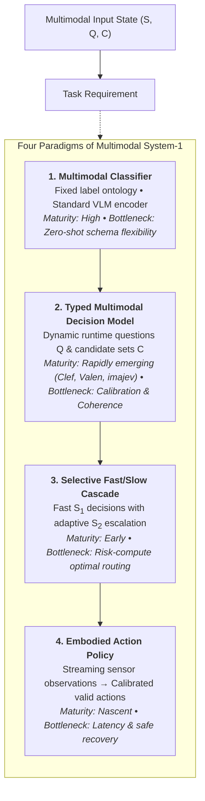
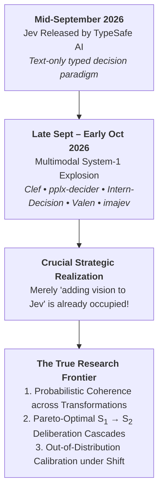
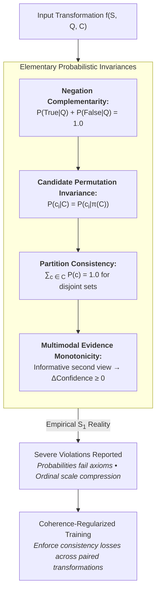
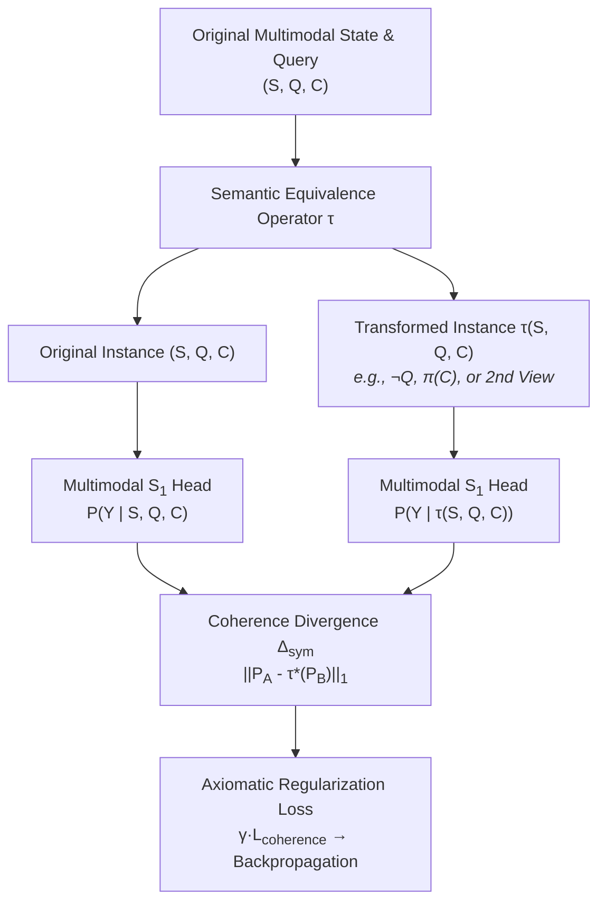
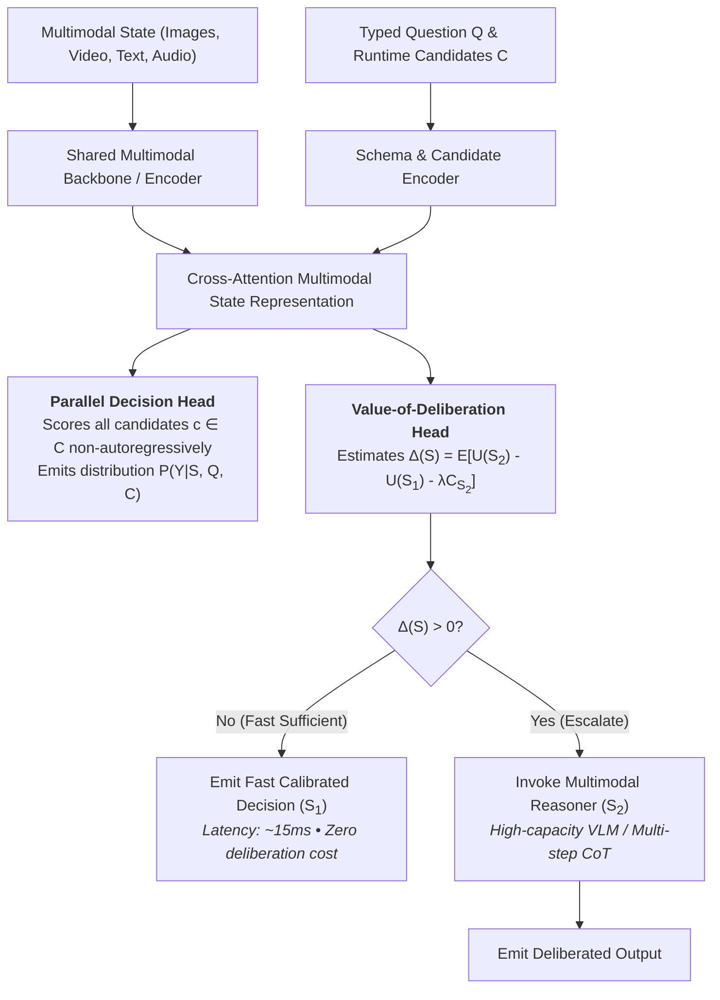
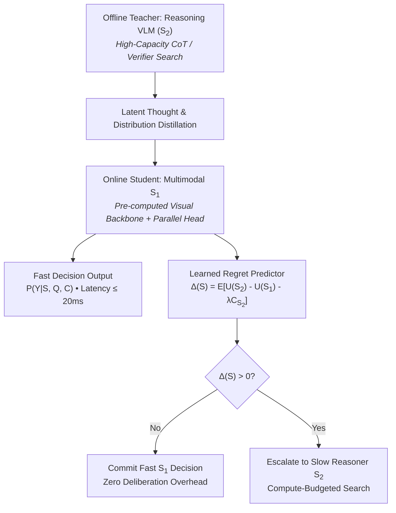
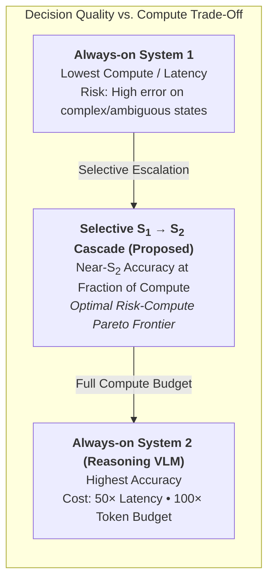

# Multimodal System-1 Decision Models: The Research Opportunity Is Beyond “Jev + Vision”

## Abstract

Typed decision models such as Jev have made a previously diffuse idea concrete: instead of asking a large language model to generate a string, a program supplies state, a decision question, and a bounded answer space, and the model returns a machine-actionable probability distribution. The natural next question is whether this interface should become multimodal. This survey asks three questions: **RQ1:** how much of “multimodal Jev” already exists as of 2 October 2026? **RQ2:** which scientific problems remain open after adding images, video, or audio? **RQ3:** which formulation is most likely to support a substantive research paper rather than an incremental modality extension? The evidence is unusually time-sensitive: Jev was released only on 15 September 2026, yet within weeks there are already multimodal direct-decision systems from Cloudflare, Perplexity, InternLM and independent open-source projects. At the same time, independent evaluations of typed decision models have exposed unresolved issues in calibration, logical coherence, ordinal-scale use, abstention, and robustness. Adjacent vision-language research independently reaches similar conclusions: multimodal classifier probabilities can be highly prompt-sensitive, and fast/slow systems improve difficult cases by selectively invoking more expensive reasoning. The resulting opportunity is therefore not “make Jev see images.” A stronger research program is **multimodal decision intelligence**: a fast, non- or minimally-autoregressive model that accepts rich multimodal state and runtime-defined decisions, emits calibrated and logically coherent distributions, and escalates uncertain cases to a slower multimodal reasoner under an explicit risk-compute objective.

## 1. Introduction

TypeSafe released Jev on 15 September 2026 as a “System One Model”: state and typed questions go in, while typed probabilistic decisions come out. The product framing emphasizes parallel structured decisions rather than open-ended text generation, with the goal of putting learned judgment directly into software hot paths [1]. Independent evaluation quickly followed. Deußer et al. evaluated Jev on 37 datasets and 346,009 requests, finding strong performance on many classification-style tasks and useful calibration for Choice outputs, but also problems such as poorly placed Binary probabilities under a fixed 0.5 threshold [2]. Tang and Zheng’s early evidence audit argues that the clearest demonstrated advantage of the new typed-decision interface is currently latency/cost rather than an independently established accuracy advantage [3].

This makes multimodality an obvious extension: many consequential software decisions depend on screenshots, camera frames, charts, documents, audio, or video rather than text alone. But the timing matters. Between late September and 1 October 2026, several multimodal direct-decision implementations appeared, including Cloudflare Clef, Perplexity pplx-decider, Intern-Decision, Valen, and imajev [6–10]. Consequently, a project whose central novelty is merely “add a vision encoder to a Jev-like model” is already difficult to defend as a research contribution.

This report therefore asks:

- **RQ1 — Occupancy:** What parts of the multimodal typed-decision design space are already occupied?
- **RQ2 — Gap:** Which properties required for trustworthy fast multimodal decisions remain weakly addressed?
- **RQ3 — Paper scope:** Which formulation turns “multimodal System-1” from an implementation project into a durable research question?

The working definition here is broader than any one vendor architecture. A multimodal System-1 model maps rich state, decision specification, and optional runtime candidate set to a bounded decision distribution under a small inference budget:

\[
(S_{text},S_{image},S_{video},S_{audio},S_{structured}, Q, C)
\rightarrow P(Y\mid S,Q,C),
\]

without relying on long chain-of-thought, tree search, repeated tool use, or open-ended autoregressive generation for every decision.

## 2. Methodology

The search was conducted through 2 October 2026. Because the exact typed-decision category is only weeks old, the corpus intentionally combines peer-reviewed work, arXiv preprints, official technical releases, model cards, and open-source technical reports, while distinguishing their evidence strength.

Five search perspectives were used:

1. **Exact typed-decision systems:** Jev and direct reproductions/extensions.
2. **Multimodal discriminative systems:** CLIP/SigLIP-style encoders, LMM classifiers, and multimodal reward models.
3. **Reliability:** calibration, probability coherence, prompt sensitivity, abstention, and selective prediction.
4. **Fast/slow inference:** System-2 distillation, adaptive reasoning, and uncertainty-triggered multimodal reasoning.
5. **Evaluation:** decision-model benchmarks and multimodal benchmark coverage.

The resulting evidence is strongest when it comes from peer-reviewed or independently evaluated work. Claims about Clef, pplx-decider, Intern-Decision, Valen, and imajev are treated as release/model-card evidence unless independently benchmarked. Vendor speed and accuracy claims are not treated as neutral measurements.

## 3. Taxonomy: What “Multimodal System-1” Can Mean

The phrase “multimodal System-1” hides at least four distinct research objects:

1. **Multimodal classifier:** pixels/audio plus a fixed label ontology -> scores.
2. **Multimodal typed decision model:** rich state plus arbitrary natural-language question and runtime candidate set -> probability distribution.
3. **Multimodal fast/slow controller:** a fast decision model answers easy cases and selectively invokes a slower reasoner.
4. **Embodied decision policy:** streaming multimodal observations plus goals and currently valid actions -> calibrated action distribution.

The first category is mature. The second has rapidly become populated. The third is scientifically underdeveloped in the typed-decision setting. The fourth is potentially the most ambitious because it connects decision models to agents, robotics, and world models rather than treating multimodality as static image classification.

| Branch | Typical input | Output | Existing maturity | Main unsolved issue |
|---|---|---|---|---|
| Multimodal classifier | image + label names | class scores | High | flexibility and reliability under changing tasks |
| Typed multimodal decision model | image/video/text + Q + runtime C | typed distribution | Rapidly growing | calibration, coherence, robustness |
| Selective fast/slow system | multimodal state + Q + C | fast answer or escalation | Adjacent work exists | principled routing and end-to-end risk/compute training |
| Embodied System-1 policy | streaming multimodal state + goal + valid actions | action distribution | Fragmented across VLA/policy work | dynamic actions, uncertainty, safe escalation |

## 4. RQ1: “Jev + Multimodality” Is Already an Occupied Space

### 4.1 The core decision-model abstraction

Jev’s important contribution is less “classification” than a software interface: the caller describes one or more decision fields and their valid outputs, and the model returns typed answers with probabilities [1]. This distinguishes the interface from a traditional classifier with a frozen ontology. DecisionBench formalizes roughly the same abstraction as state plus typed question plus runtime answer space, evaluating 43 tasks across 28 domains with accuracy, calibration, negative log likelihood, and coverage [11]. The Decision Index has already expanded the ecosystem to dozens of open Jev-like systems [12].

The crucial point is that **dynamic decision specification** is what makes this paradigm interesting. If the candidate vocabulary and task are fixed during training, the system is mostly a conventional classifier with modern pretraining.

### 4.2 Multimodal direct-decision systems appeared almost immediately

Cloudflare’s Clef and Clef-flash, released 1 October 2026, are direct evidence that vision support alone is no longer a research gap. Cloudflare describes the models as Jev-compatible, with image input, a prefill-only Qwen backbone pass, and parallel scoring of valid schema choices rather than autoregressive answer generation [6]. Their architecture adds option-specific evidence routing and cross-field attention, and their training includes a Brier term intended to improve calibration. These are vendor-reported details and performance numbers, but the architectural occupancy is clear.

Perplexity’s open pplx-decider-v1-27b similarly accepts images and returns a selected choice with probability scores [7]. Intern-Decision accepts a state, optional images, and multiple typed questions; it uses a causal backbone but constrains the learning/inference interface to legal answer symbols and includes temperature calibration tooling [8]. Valen supports text, images, and video and uses a shared decision head to score candidates without generating answer tokens [9]. imajev accepts photos, application state, typed questions, and an explicit unknown option; it also ships a small multimodal benchmark, though the current benchmark is explicitly a preview with AI-generated imagery and no human audit [10]. Audio-native experiments such as Prosodia have also begun to appear, showing that modality expansion is already moving beyond vision.

| System | Multimodal state | Runtime typed questions/options | Probability output | Answer-token generation | Evidence status |
|---|---|---|---|---|---|
| Jev [1] | Text/structured text | Yes | Yes | No/open proprietary mechanism | Vendor + independent eval |
| Clef [6] | Text + images | Yes | Yes | Decision step non-autoregressive | Official open release |
| pplx-decider [7] | Text + images | Yes | Yes | Specialized decider interface | Official model card |
| Intern-Decision [8] | Text/state + images | Yes | Yes | Causal backbone; legal answer-symbol scoring | Open technical repo |
| Valen [9] | Text + images + video | Yes | Yes | Shared decision head, no answer-token generation | Open technical repo |
| imajev [10] | Photos + app state | Yes + explicit unknown | Yes | Direct option scoring | Open technical report + benchmark |

**Implication:** a paper titled conceptually “Multimodal Jev: Extending System-One Models to Images” would now face an immediate novelty challenge. Multiple systems already instantiate that proposition.

### 4.3 Multimodal scoring itself predates the Jev wave

Even before typed-decision models, multimodal research already had strong non-generative decision substrates. SigLIP 2 provides multilingual image-text encoders with strong zero-shot classification and retrieval capability [13]. Garosi et al. show that large multimodal models can also operate as flexible in-context classifiers and, with suitable context, can match or surpass contrastive VLM baselines on some closed-world classification settings [14]. ImageReward learns human preference scores over text-image pairs from 137k expert comparisons, illustrating that multimodal “judgment” models have long existed outside the typed-decision vocabulary [21].

Therefore, the scientific novelty cannot simply be “vision model returns scores instead of prose.” The new question has to be about **what dynamic typed decisions buy, how trustworthy the probabilities are, and how they compose with reasoning systems**.

## 5. RQ2: Reliability Is the More Durable Open Problem

### 5.1 Calibration is necessary but not sufficient

Jev-style systems emphasize calibrated probabilities, but independent work already shows why a single expected calibration error is too weak a reliability story. Deußer et al. find that Jev’s Choice probabilities can support selective prediction while Binary probabilities may still need threshold tuning [2]. Tang and Zheng identify calibration and deferral as central evaluation requirements and caution that the evidence base is extremely young [3].

For multimodal models, the problem predates Jev. LeVine et al. show that zero-shot CLIP inference is miscalibrated and propose a temperature-scaling variant that transfers across datasets/prompts for a fixed CLIP configuration [15]. More recently, Weng et al. show that semantically equivalent prompt rewrites can cause materially different first-token safety probabilities in VLMs; averaging across prompt variants improves NLL on all 14 dataset-model pairs in their study and ECE on 12 of 14 [16].

These findings meet in an important gap: a multimodal decision model may be globally calibrated yet still produce different probabilities when the user rephrases an equivalent question, changes candidate order, removes an irrelevant modality, or asks logically related questions.

### 5.2 Probability coherence is a stronger research target

Li et al. directly test whether Jev’s probabilities obey elementary logical relationships. On their test set, probabilities for a statement and its negation fail to sum exactly to one, and sets of mutually exclusive labels can receive aggregate mass inconsistent with a single coherent distribution [4]. Gao et al. identify a different decision-interface pathology: as ordinal candidate sets become richer, Jev-like models can compress their use of the provided scale, even when their underlying candidate probabilities remain broader [5].

These are especially relevant to multimodality because adding modalities creates new equivalence and consistency constraints. For example:

- A question asked about an image alone versus the same image plus a faithful caption should not change arbitrarily.
- Reordering semantically identical answer candidates should not change the distribution except by permutation.
- “Is object X present?” and “Is object X absent?” should be complementary when the ontology is genuinely binary.
- A video-level decision should be compatible with evidence accumulated from its relevant frames.
- A model that is uncertain because the image is occluded should become more confident when an informative second view is added, not merely different.

This suggests a research objective beyond calibration: **cross-query, cross-candidate, and cross-modal probabilistic coherence**.

### 5.3 The benchmark gap is real but must be attacked carefully

DecisionBench and the Decision Index provide substantial infrastructure for text-centric typed decisions [11,12]. imajev introduces a multimodal benchmark, but its authors themselves characterize the current 279-item test as a preview using AI-generated images without human audit [10]. In this search, no mature, peer-reviewed benchmark was retrieved that jointly measures:

- dynamic runtime answer spaces;
- image/video/audio plus structured state;
- probability calibration;
- logical and candidate-set coherence;
- abstention/selective prediction;
- latency and compute;
- robustness to prompt, modality, and candidate perturbations.

A benchmark paper could therefore be meaningful, but only if it goes beyond collecting visual classification datasets under a Jev-shaped API. The benchmark should stress the properties that distinguish decision models from generic classifiers.

## 6. RQ2 Continued: Fast/Slow Multimodal Inference Is an Important Adjacent Frontier

The System-1/System-2 framing is already active outside the Jev ecosystem, but current work mostly uses different interfaces.

Yu et al. show that expensive System-2 procedures can sometimes be distilled into cheaper direct behavior, effectively “compiling” deliberation into System-1 inference [17]. FAST adapts reasoning length in large vision-language models and reports substantial token savings while improving accuracy relative to its base setting [18]. SCAN uses a fast VLM candidate-identification stage and invokes more detailed reasoning about fine-grained visual distinctions when System-1 is uncertain [19]. CritiqueDriveVLM trains a stronger reasoning teacher and then distills its latent reasoning state into a faster, CoT-free driving VLM student, reporting a large latency reduction on its autonomous-driving benchmark [20].

These works support the general fast/slow hypothesis, but they leave an opening for typed multimodal decision models. A Jev-like System-1 layer has three properties that make a cascade scientifically interesting:

1. It already emits a decision distribution, giving a natural routing signal.
2. Its candidate space is explicit, allowing the slow model to focus on a bounded decision rather than regenerate an unconstrained answer.
3. The surrounding software can define a cost or risk threshold, making the compute allocation problem measurable.

The core research question becomes:

> **Can a dedicated multimodal decision model handle most decisions with calibrated low-cost inference, while a slower reasoning model is invoked only when its expected value exceeds its compute cost?**

That is more substantive than simply shortening a VLM’s chain-of-thought. It asks whether a heterogeneous architecture with genuinely different fast and slow models can achieve a better **risk–compute frontier**.

## 7. RQ3: Research Directions Ranked by Scientific Defensibility

### 7.1 Strongest: Calibrated Multimodal System-1 with Selective System-2 Escalation

This is the most coherent paper direction emerging from the literature.

#### Problem

Given multimodal state \(S\), a set of typed questions \(Q_j\), and runtime candidate sets \(C_j\), a fast model produces:

\[
p_j = P(Y_j \mid S,Q_j,C_j).
\]

A routing controller then chooses:

\[
r_j \in \{\text{accept System-1},\text{invoke System-2},\text{abstain/human}\}.
\]

The objective is not merely accuracy. It minimizes expected decision risk plus compute:

\[
\mathcal{L}=\mathbb{E}[\ell(\hat y,y)] + \lambda\,\mathbb{E}[\text{compute}] + \beta\,\mathcal{L}_{calib} + \gamma\,\mathcal{L}_{coherence}.
\]

#### Training

A plausible training program would combine:

- supervised typed-decision loss;
- Brier/NLL calibration terms;
- consistency losses across equivalent prompt forms and candidate permutations;
- cross-modal consistency/counterfactual pairs;
- teacher distribution or latent-state distillation from a reasoning VLM;
- selective-routing loss trained on whether System-2 actually corrects System-1;
- explicit abstention/OOD examples.

The key point is that **uncertainty should be decision-useful**, not merely cosmetically calibrated.

#### Evaluation

A strong paper should report a Pareto frontier rather than one accuracy number:

- accuracy / macro-F1 / ranking quality;
- NLL and Brier score;
- ECE or adaptive calibration error;
- risk-coverage curves and selective accuracy;
- AUROC/AUPRC for detecting System-1 failure;
- probability-coherence violations;
- prompt-rewrite and candidate-permutation sensitivity;
- modality ablation/missing-modality robustness;
- OOD performance;
- p50/p95 latency, throughput, memory, and ideally energy;
- fraction of cases escalated to System-2;
- end-to-end utility under several compute-cost coefficients.

The decisive experiment would ask whether the cascade matches or approaches always-on System-2 accuracy while consuming only a fraction of its average compute, and whether calibration/coherence remains valid under multimodal distribution shift.

### 7.2 Very strong: Multimodal Probability Coherence as the Central Contribution

This is narrower and potentially cleaner scientifically.

Instead of building a full cascade first, define a systematic suite of probabilistic invariances and train for them:

- negation/complement consistency;
- partition consistency for mutually exclusive candidates;
- candidate-order invariance;
- candidate-set expansion/contraction consistency;
- paraphrase consistency;
- image + faithful-caption consistency;
- frame-to-video evidence consistency;
- missing-modality uncertainty monotonicity.

This direction connects the fresh Jev coherence failures [4,5] with known VLM prompt sensitivity [16]. It could yield both a benchmark and a method. The contribution remains valuable even if product architectures change, because the research object is the **semantics of probabilities under multimodal decision transformations**.

### 7.3 Strong but harder: Embodied System-1 for Dynamic Action Selection

A more ambitious formulation uses multimodal System-1 as the hot-path policy of an agent:

\[
(\text{camera/screen},\text{audio},\text{structured state},\text{goal},\text{valid actions})
\rightarrow P(a).
\]

The candidate action set can change every timestep. Easy states are handled by System-1; ambiguous or high-risk states invoke a world model, planner, or reasoning VLM. This turns typed decision models into a bridge between perception and deliberative agents.

The difficulty is evaluation: to be convincing, the work needs environments with dynamic actions, consequential mistakes, and realistic latency constraints. A GUI agent or simulator may be easier to study reproducibly than physical robotics.

### 7.4 Medium-high: A Serious Multimodal Decision Benchmark

A benchmark could be publishable if it tests the model class rather than merely wrapping existing VQA datasets. It should include genuinely runtime-defined candidate sets, unknown/abstention cases, logically linked questions, perturbations, and latency-normalized evaluation. A high-quality human-audited benchmark would currently fill a clearer gap than another model implementation.

### 7.5 Weak by itself: “Add Images/Video/Audio to Jev”

As of 2 October 2026, this is the least defensible standalone contribution. Clef, pplx-decider, Intern-Decision, Valen, imajev and audio-native experiments already occupy the modality-extension story [6–10]. A new implementation can still be useful engineering, but the research paper must ask a stronger question.

## 8. A Concrete Paper I Would Build

### Working title

**Multimodal Decision Models for Adaptive Fast–Slow Inference**

Alternative, more specific:

**Coherent Multimodal System-1: Calibrated Decisions with Selective System-2 Escalation**

### Hypothesis

A dedicated multimodal System-1 model trained for calibration and probabilistic coherence can answer the majority of bounded multimodal decisions substantially more cheaply than an always-on reasoning VLM, while a learned escalation policy recovers most of the reasoning model’s accuracy on hard cases.

### Architecture

1. **Multimodal state encoder**: reuse a strong VLM encoder/backbone; support image + text first, then video/audio only if experiments justify them.
2. **Question/candidate encoder**: arbitrary natural-language questions and runtime candidates.
3. **Parallel decision head**: score all candidate answers directly from shared state representations.
4. **Calibration/coherence head or objective**: enforce consistency under transformations.
5. **Escalation head**: predict expected regret of accepting System-1 versus invoking System-2.
6. **System-2 teacher**: a strong reasoning VLM whose final distribution and/or latent reasoning representation becomes a distillation target.

### Critical baselines

- Jev on text-compatible subsets;
- Clef/Clef-flash;
- pplx-decider;
- open multimodal typed-decision models where reproducible;
- base VLM first-token or constrained-option scoring;
- SigLIP/CLIP-style classifier for fixed-label tasks;
- always-on reasoning VLM;
- confidence-threshold cascade;
- random/budget-matched escalation;
- a homogeneous fast/slow VLM baseline such as adaptive reasoning length.

### The experiment that would make the paper

Plot **task risk versus average inference compute/latency**. If the proposed system shifts the Pareto frontier across multiple datasets and distribution shifts, while also lowering coherence violations, that is a considerably stronger result than “our multimodal Jev variant has higher accuracy.”

## 9. Risks and Falsification Criteria

Several outcomes would weaken the research thesis:

1. **Generic VLM option scoring is already enough.** If a frozen multimodal backbone plus simple candidate scoring matches a specialized decision model on calibration, latency, and robustness, the specialized architecture has little justification. Tang and Zheng’s audit makes this a real possibility for typed models generally [3].
2. **Confidence does not predict when System-2 helps.** A cascade only matters if System-1 uncertainty or a learned error predictor can identify correctable failures. Otherwise always-fast or always-slow policies may dominate.
3. **System-2 mistakes are correlated with System-1 mistakes.** Escalation provides little value when both models fail on the same cases.
4. **Calibration collapses under shift.** A decision model that is calibrated only in-distribution is not adequate for machine autonomy.
5. **Latency is dominated by multimodal encoding.** If vision/video encoding dominates total cost, optimizing the decision head may yield negligible end-to-end gains. This is a reason to investigate state-encoding reuse across many questions or timesteps.

These failure modes are useful because they make the project falsifiable rather than purely architectural.

## 10. Conclusion

**RQ1 — Is multimodal Jev-like System-1 an interesting area?** Yes as a broader research area, but no longer because multimodality itself is novel. Vision-enabled and even video/audio-oriented Jev-like systems appeared within weeks of Jev’s release. A paper whose contribution is only modality support is already exposed to strong novelty objections.

**RQ2 — What is still open?** The strongest unresolved issues are the trustworthiness and orchestration of fast decisions: calibration under distribution shift, logical and cross-modal probability coherence, abstention, dynamic candidate-set robustness, and deciding when fast inference should yield to expensive reasoning. Independent Jev evaluations and multimodal calibration studies point to the same reliability gap from different directions.

**RQ3 — What is the strongest paper formulation?** The most defensible direction is **a calibrated/coherent multimodal System-1 model with selective System-2 escalation, evaluated on an explicit risk–compute frontier**. A narrower but also strong alternative is to make **multimodal probability coherence** the main scientific object and contribute both a benchmark and a training method. An embodied version, where the runtime candidates are actions in a GUI/robotic environment, could be even more consequential but requires substantially more experimental infrastructure.

The strategic lesson is to make the research question invariant to the current product wave. “Can a model see images?” will be obsolete immediately. “Can a machine make fast multimodal decisions whose uncertainty is semantically coherent and knows when deliberation is worth the cost?” is likely to remain a real research problem.

## References

[1] D. Almeida, “Introducing System One Models & Jev,” TypeSafe AI technical release, 2026.

[2] T. Deußer, L. Sparrenberg, R. Sifa, “Evaluating and Benchmarking the System One Model Jev,” arXiv:2609.37647, 2026.

[3] L. Tang, Y. Zheng, “Typed Decision Models: An Early Evidence Audit and Evaluation Checklist,” arXiv:2609.32160, 2026.

[4] K. Li, Y. He, Q. Li, “Beyond Calibration: Do a Typed-Decision Model’s Probabilities Obey the Probability Axioms?,” arXiv:2609.33209, 2026.

[5] T. Gao, J. Li, Z. Li, Y. Chang, Y. Wu, “More Choices, Fewer Decisions: Ordinal-Scale Bias in JEV-like Direct-Decision Models,” arXiv:2609.38827, 2026.

[6] M. Chen, A. Reneau, K. Flansburg, “Introducing Clef: our open-source decision models, and new RL fine-tuning platform,” Cloudflare technical release, 2026.

[7] Perplexity AI, “pplx-decider-v1-27b,” Hugging Face model card, 2026.

[8] InternLM, “Intern-Decision: Fast multi-modal decision model,” open-source technical release, 2026.

[9] Z. Liu, “Valen: Train a Jev-like multimodal model by yourself,” open-source technical release, 2026.

[10] M. Garg, “imajev 1.0: Typed decisions from photos and app state,” technical report, 2026.

[11] Hanno Labs, “DecisionBench: an open benchmark for Jev and decision models,” benchmark release, 2026.

[12] A. Apolinario et al., “Decision Index,” open benchmark/reproduction suite, 2026.

[13] M. Tschannen et al., “SigLIP 2: Multilingual Vision-Language Encoders with Improved Semantic Understanding, Localization, and Dense Features,” arXiv:2502.14786, 2025.

[14] M. Garosi, M. Farina, A. Conti, M. Mancini, E. Ricci, “Large Multimodal Models as General In-Context Classifiers,” CVPR Findings, 2026.

[15] W. LeVine, B. Pikus, P. Raja, F. A. Gil, “Enabling Calibration In The Zero-Shot Inference of Large Vision-Language Models,” arXiv:2303.12748, 2023.

[16] C. Weng, D. Li, A. Martin, “Prompt-Induced Score Variance in Zero-Shot Binary Vision-Language Safety Classification,” arXiv:2605.00326, 2026.

[17] P. Yu, J. Xu, J. Weston, I. Kulikov, “Distilling System 2 into System 1,” arXiv:2407.06023, 2024.

[18] W. Xiao et al., “Fast-Slow Thinking for Large Vision-Language Model Reasoning,” arXiv:2504.18458, 2025.

[19] Y. Yang, L. Huang, Y. Lin, X. Peng, M. Yang, “Endowing Vision-Language Models with System 2 Thinking for Fine-grained Visual Recognition,” AAAI, 2026.

[20] Z. Liu, H. Ye, X. Zhang, M. Qi, “CritiqueDriveVLM: From Verifier-Guided Reinforcement Learning to Latent Thought Distillation for Autonomous Driving,” arXiv:2607.04179, 2026.

[21] J. Xu et al., “ImageReward: Learning and Evaluating Human Preferences for Text-to-Image Generation,” NeurIPS, 2023.
